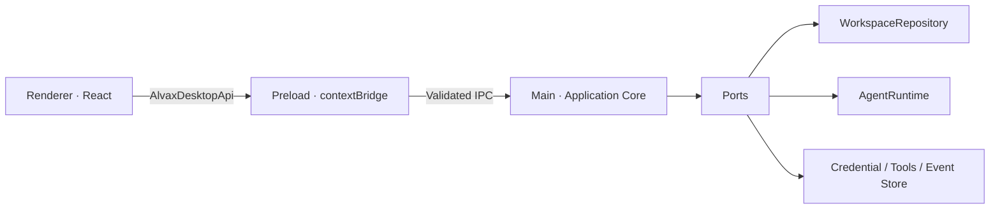

# Alvax Studio 架构设计

## 1. 设计背景

产品功能尚在调研，当前最重要的不是预设完整业务，而是尽早固定那些以后代价最高的边界：桌面安全、跨进程契约、Agent 定义、运行生命周期、供应商隔离和数据迁移入口。

设计目标：

- 产品方向变化时，UI 与业务用例可以快速重组。
- 模型供应商、工具系统、存储介质和编排策略都可替换。
- renderer 被视为不可信 Web 环境，不能获得 Node、文件系统或密钥能力。
- 先用最小本地实现验证交互，不提前引入数据库、队列或后端服务。

当前非目标：

- 不承诺最终的 Agent 协作范式。
- 不实现模型供应商登录、付费、同步和团队权限。
- 不把 Mock Runtime 伪装成真实 AI 能力。

## 2. 总体分层



依赖规则：

1. renderer 只依赖 shared contract，不依赖 Electron 或 Node。
2. preload 只负责窄桥接和事件反序列化，不放业务逻辑。
3. application core 依赖端口，不依赖 JSON、SQLite 或具体模型 SDK。
4. infrastructure adapter 实现端口，可独立替换。

## 3. 进程边界

### Renderer

负责视图、短生命周期 UI 状态和用户输入。不允许使用 `nodeIntegration`，也不直接发网络请求到模型供应商。

### Preload

通过 `contextBridge` 暴露 `window.alvax`。每个方法绑定一个固定 IPC channel，不暴露通用 `send(channel, payload)`，避免页面任意调用主进程能力。

### Main

持有系统权限、数据存储、密钥（未来）、模型网络访问（未来）和编排生命周期。IPC handler 同时验证调用窗口、主 frame 和 Zod schema。

## 4. 核心模型

### AgentDefinition

- `id / name / role / description`
- `capabilities / instructions`
- `status: draft | active | disabled`
- `runtime`: 只保存运行时类型、模型名、HTTPS endpoint 和 `credentialKey`
- 不允许保存或通过 IPC 传递原始 API key

### RunRecord

- `objective / agentIds / mode`
- `status: queued | running | completed | failed | cancelled`
- `summary / createdAt / updatedAt`

### RunEvent

当前是粗粒度生命周期事件：`run.started`、`agent.started`、`agent.completed`、`run.completed`、`run.failed`、`run.cancelled`。以后增加 token delta、tool call 或 artifact 时，应新增独立事件类型，避免改变已有事件含义。

## 5. AgentRuntime 端口

```ts
interface AgentRuntime {
  execute(
    request: {
      runId: string;
      objective: string;
      mode: CoordinationMode;
      agent: AgentDefinition;
      priorOutputs: readonly AgentExecutionResult[];
    },
    signal: AbortSignal,
  ): Promise<AgentExecutionResult>;
}
```

这条边界让以下实现对编排器等价：

- OpenAI-compatible HTTPS adapter
- 本地模型或 sidecar 进程
- 公司内部 Agent 服务
- 测试 / 研究模拟器

如果后续需要 token 流式输出，将返回值升级为 `AsyncIterable<AgentRuntimeEvent>`，同时保留一个聚合 helper 兼容不支持流式的 provider。

## 6. 编排策略

界面已预留三种模式，但当前 Mock Runtime 统一按顺序执行：

- `supervisor`：主管拆解、委派、聚合；适合开放问题。
- `round-robin`：每个 Agent 读取前序输出并迭代；适合讨论与审稿。
- `pipeline`：固定阶段和输入输出 schema；适合稳定业务流程。

产品调研阶段应先验证用户希望控制的是“角色”“步骤”还是“结果约束”，再确定最终编排 DSL。不要现在就引入复杂图编辑器。

## 7. 数据策略

`WorkspaceRepository` 是持久化端口，当前 JSON adapter 采用临时文件 + rename 的原子写入，串行化进程内 mutation，并限制保留最近 100 次运行。

迁移到 SQLite 的触发条件：

- 需要事件回放或审计；
- 运行记录达到数千级；
- 需要全文检索与聚合查询；
- 同一工作区需要多进程并发写入；
- 需要可恢复的 schema migration。

迁移时保持 repository 方法不变，并为 JSON v1 提供一次性 importer。

## 8. 安全基线

- `contextIsolation: true`
- `sandbox: true`
- `nodeIntegration: false`
- 自定义安全 `alvax://` 协议，避免直接使用 `file://`
- 严格 CSP、拒绝 popup、限制导航、拒绝所有默认权限
- IPC 验证 sender window、top frame 和输入 schema
- renderer 不接触 provider secret
- ASAR + Embedded ASAR Integrity + `OnlyLoadAppFromAsar`
- 禁用 `RunAsNode`、`NODE_OPTIONS` 和 CLI inspect fuses

正式上线还需补充：系统钥匙串、日志脱敏、依赖 SBOM、自动更新签名、代码签名、macOS notarization、Windows installer 签名和安全回归测试。

## 9. 已知权衡

- Electron Forge Vite 插件仍被官方标为 experimental。项目锁定精确版本、保持入口薄层，并通过真实 package 测试控制风险。
- JSON 存储降低调研成本，但不承担长期事件数据库职责。
- 当前单窗口和单进程编排最容易观察。执行不可信工具或长任务后，应迁到 utility process / sidecar 并增加资源限制。
