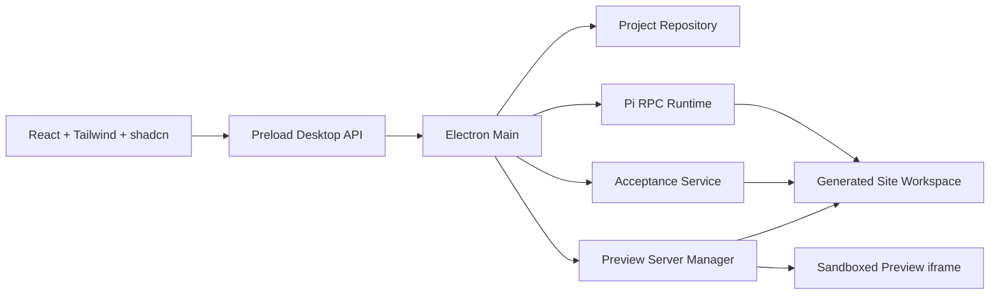
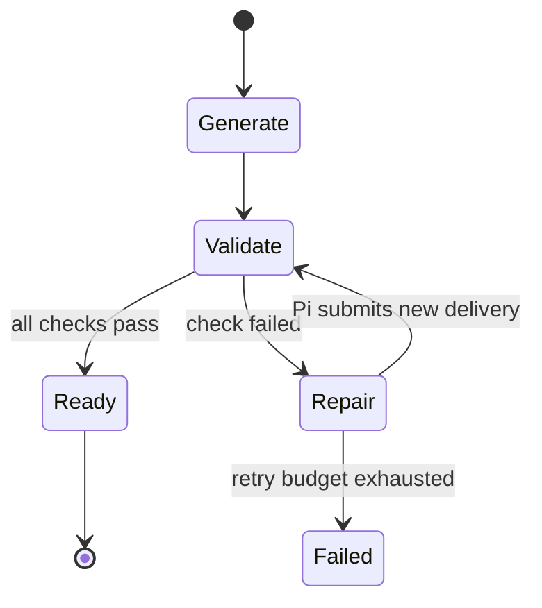

# Alvax AI 网站生成器开发方案

> 状态：Proposal  
> 开发分支：`feat/pi-website-builder`  
> 基线：Electron + React + TypeScript + Electron Forge 现有脚手架  
> Agent Runtime：Pi Coding Agent

## 1. 目标

在现有 Alvax AI Electron 安全边界之上，开发一个对话驱动的网站生成工作台。用户提供行业、产品或服务、目标用户和网站用途，Pi Agent 完成需求澄清、信息架构、页面文案、基础视觉、代码生成、构建修复和本地预览交付。

MVP 必须形成一条真实闭环：

1. 用户在聊天输入框提交网站基础信息；
2. AI 分析并补问缺失信息；
3. AI 给出站点结构，并生成 Home、Use Cases、FAQ、Blog Index、Article 等所需页面；
4. Pi Agent 在隔离的项目工作区内写入真实网站源码；
5. Alvax 执行确定性验收：语法检查、构建、启动、HTTP 可访问性；
6. 验收失败时把结构化错误送回同一个 Pi session 修复；
7. 验收通过后在右侧交付面板直接展示网站。

## 2. MVP 范围

### 包含

- 新建、继续和删除本地网站项目；
- 结构化采集行业、产品/服务类型、目标用户、品牌调性、网站目标和页面需求；
- 对话式补问与流式聊天记录；
- 网站结构、文案、组件和代码生成；
- Home、Use Cases、FAQ、Blog Index、Article Detail 页面模板；
- Pi session、工具调用、构建日志和交付物实时同步；
- 本地 preview server 生命周期管理；
- Preview、Files、Checks、Logs 四类交付视图；
- 语法、构建、启动、HTTP 健康检查；
- 取消生成、失败重试、应用退出时清理子进程。

### 暂不包含

- 公网发布、域名、CDN、云托管和账号体系；
- CMS 后台、多人协作和在线数据库；
- 任意框架生成；MVP 固定一种网站模板技术栈；
- 用户上传大型素材库；首版只支持少量 Logo / 图片引用；
- 让 Agent 自己宣称“验收通过”；最终状态必须来自主进程的确定性检查。

## 3. 产品流程

### 3.1 新项目

首条消息可以是自然语言，也可以通过 Composer 中的“项目 brief”入口填写结构化字段：

```ts
interface WebsiteBrief {
  industry: string;
  offeringType: "product" | "service" | "platform" | "content" | "other";
  offeringDescription: string;
  targetAudience: string;
  goals: Array<"brand" | "product" | "lead-generation" | "content">;
  locale: string;
  brandTone?: string;
  requiredPages?: WebsitePageKind[];
  references?: string[];
}
```

Agent 只追问阻塞生成的问题。达到最低信息完整度后，在聊天区输出可确认的 Site Plan：页面列表、每页目标、内容区块和视觉方向。用户确认后才开始写代码。

### 3.2 生成过程

聊天时间线显示产品语义事件，而不是原始 JSONL：

- 正在分析目标用户；
- 已生成站点结构；
- 正在编写 Home；
- 已修改 `src/pages/home.tsx`；
- 正在安装依赖 / 构建；
- 验收失败，开始第 1 次修复；
- 网站已就绪。

工具调用默认折叠，只展示工具名、目标文件和状态；详细 stdout / stderr 放在右侧 Logs。

### 3.3 交付

验收通过后右侧自动切换到 Preview。用户可以刷新、在默认浏览器打开、复制本地地址、重新运行检查。交付物包含：

- 网站源码目录；
- Site Plan；
- 页面与路由清单；
- 验收报告；
- 当前 preview URL；
- Pi session 与生成日志。

## 4. UI / UX 方案

参考图采用三段主结构：顶部任务栏、左侧对话工作区、右侧交付区；Composer 固定在左侧底部。

```text
┌───────────────────────────────────────────────────────────────────────┐
│ Alvax AI / 项目标题                    Runtime · Model · More         │
├────────────────────────────────────────────┬──────────────────────────┤
│                                            │ Delivery                 │
│ Chat timeline                              │ Preview | Files | Checks │
│ - user brief                               │                          │
│ - agent analysis                           │    live website iframe   │
│ - tool / build markers                     │    or artifact list      │
│                                            │                          │
│                                            │                          │
├────────────────────────────────────────────┤                          │
│ +  Ask Alvax to build or revise…      ↑    │                          │
└────────────────────────────────────────────┴──────────────────────────┘
```

### 4.1 桌面布局

- 顶部栏：52–56px，标题可编辑，显示 `Planning / Generating / Validating / Ready / Failed` 状态；
- 主区域：`ResizablePanelGroup`，默认聊天 68%、交付 32%；
- 聊天区：消息自动跟随流式输出，用户向上滚动后停止抢焦点并显示“回到最新”；
- Composer：底部 sticky，多行输入，支持 `Enter` 发送、`Shift+Enter` 换行、附件、停止按钮；
- 交付区：最小 360px，可折叠；宽度不足时转换为右侧 `Sheet`；
- Preview：保持浏览器比例，可切换 Desktop / Tablet / Mobile viewport；
- Files：文件树与最近变更，不在 renderer 直接读取磁盘；
- Checks：每项显示 pending / running / passed / failed、耗时和错误摘要；
- Logs：按 Pi、Install、Build、Preview 分类，支持复制和清空视图。

### 4.2 shadcn/ui 组件策略

当前项目尚未初始化 shadcn 和 Tailwind。实施时先初始化 Tailwind CSS v4 与 shadcn，推荐 `base-nova` 作为现代化起点，再根据品牌 token 调整，不在页面中写裸颜色值。

| 场景 | 组件 |
|---|---|
| 主分栏 | `ResizablePanelGroup`, `ResizablePanel`, `ResizableHandle` |
| 交付切换 | `Tabs`, `TabsList`, `TabsTrigger`, `TabsContent` |
| Composer | `InputGroup`, `InputGroupTextarea`, `InputGroupAddon`, `Button` |
| Brief 表单 | `FieldGroup`, `Field`, `FieldSet`, `ToggleGroup`, `Select` |
| 运行状态 | `Badge`, `Progress`, `Spinner`, `Alert` |
| 空态 / 加载 | `Empty`, `Skeleton` |
| 小屏交付 | `Sheet`，必须包含 `SheetTitle` |
| 操作确认 | `AlertDialog` |
| 通知 | `sonner` |

聊天原语不在当前 `@shadcn` 核心 registry 中。开始 UI 实现前应确认采用哪个聊天组件 registry；无论来源如何，统一封装为 `MessageScroller`、`Message`、`Bubble`、`Marker`、`Attachment`，让组件层负责流式跟随、锚定和回到最新，业务页面不自行实现滚动 hook。

### 4.3 视觉语言

- 中性背景、细边框、少量品牌强调色，避免传统后台仪表盘感；
- 内容区最大化，工具日志降低视觉权重；
- 字体层级集中在 12 / 14 / 16 / 20px；
- 动效只表达状态变化：streaming、check progress、preview ready；
- 所有颜色使用 shadcn semantic tokens，支持系统浅色 / 深色；
- 键盘可完成发送、停止、切换交付 Tab 和关闭 Sheet。

## 5. 技术架构



沿用现有约束：renderer 不访问 Node、Shell、文件系统或 provider 密钥；所有进程管理和文件操作都在 main process，通过窄 preload API 暴露。

### 5.1 建议目录

```text
src/
├── main/
│   ├── website-builder/
│   │   ├── application/       # create project, send prompt, validate, preview
│   │   ├── domain/            # project, conversation, artifact, check schemas
│   │   ├── pi/                # probe, RPC process, JSONL parser, event normalizer
│   │   ├── acceptance/        # syntax/build/start/http checks
│   │   └── preview/           # port allocation and process lifecycle
│   └── infrastructure/
│       └── website-project-repository.ts
├── preload/
├── renderer/
│   ├── features/website-builder/
│   │   ├── chat/
│   │   ├── composer/
│   │   ├── delivery/
│   │   └── project-shell/
│   └── components/ui/         # shadcn-owned source
└── shared/contracts/
    ├── website-project.ts
    ├── conversation.ts
    ├── delivery.ts
    └── acceptance.ts
```

### 5.2 数据模型

```ts
type WebsiteProjectStatus =
  | "draft"
  | "planning"
  | "awaiting-confirmation"
  | "generating"
  | "validating"
  | "repairing"
  | "ready"
  | "failed"
  | "cancelled";

interface WebsiteProject {
  id: string;
  title: string;
  status: WebsiteProjectStatus;
  brief: WebsiteBrief;
  workspaceRef: string; // renderer 不接收绝对路径
  piSessionId?: string;
  createdAt: string;
  updatedAt: string;
}

interface AcceptanceCheck {
  id: string;
  projectId: string;
  kind: "syntax" | "build" | "preview-process" | "http-health";
  status: "pending" | "running" | "passed" | "failed";
  summary: string;
  logRef?: string;
  durationMs?: number;
}

interface DeliveryArtifact {
  id: string;
  projectId: string;
  kind: "site-plan" | "file" | "preview" | "acceptance-report";
  label: string;
  relativePath?: string;
  createdAt: string;
}
```

项目元数据继续经 repository port 持久化。生成网站位于：

```text
app.getPath("userData")/website-projects/{projectId}/workspace
```

所有路径先 `realpath` / `resolve`，必须保持在对应 project root 内。renderer 只接收相对路径和 opaque reference。

## 6. Pi Agent 集成

### 6.1 运行方式

MVP 使用 Pi CLI 子进程：

```text
node {piPath} --mode rpc
```

选择 RPC 而不是直接嵌入 SDK 的原因：

- Pi 与 Electron main process 生命周期隔离；
- 可按项目取消、超时和回收 PID；
- 可以复用 Aegis 已验证的 JSONL RPC、session 恢复和 guard 设计；
- 未来迁到 utility process、容器或 sidecar 时不改变应用层接口。

RPC 使用严格 LF 分隔 JSONL。解析器必须按 `\n` 切帧并保留不完整尾帧，不能使用会按 Unicode 行分隔符切分的通用 line reader。原始 Pi event 先在 main 中归一化为 Alvax event，renderer 不依赖 Pi wire protocol。

正式依赖使用当前 `@earendil-works/*` 包名；不要新增已弃用的 `@mariozechner/pi-agent-core`。

### 6.2 Runtime 端口

扩展现有 `AgentRuntime`，增加流式 session 能力：

```ts
interface WebsiteAgentRuntime {
  probe(): Promise<PiRuntimeProbe>;
  start(input: StartWebsiteSessionInput): Promise<WebsiteAgentSession>;
  send(sessionId: string, message: string): Promise<void>;
  cancel(sessionId: string): Promise<void>;
  subscribe(sessionId: string, listener: (event: WebsiteAgentEvent) => void): () => void;
}
```

不要把本功能塞进当前 `MockAgentRuntime.execute()` 的一次性 Promise；网站生成是长生命周期、可多轮对话、可修复的 session。

### 6.3 Agent 指令与工具

为每个生成工作区写入项目级 `AGENTS.md`，内容包括：固定网站栈、允许目录、命令、页面要求、完成定义和禁止事项。通过 Pi extension 提供少量结构化工具：

- `alvax_submit_site_plan`：提交页面与 section 结构，进入用户确认；
- `alvax_report_artifact`：登记生成文件或设计说明；
- `alvax_submit_delivery`：声明候选入口、页面清单和生成总结；
- `alvax_report_progress`：把稳定的阶段进度发送给 UI。

Pi 保留 `read / write / edit / bash`，但增加 guard：

- 读写只能在项目 workspace；
- 禁止 shell 字符串直接拼接用户输入；
- 限制危险命令、父目录访问和后台常驻进程；
- preview server 由主进程启动，Agent 不自行留下后台进程；
- 第三方依赖安装与网络访问需要明确策略。

### 6.4 生成网站技术栈

MVP 固定生成站点为 Vite + React + TypeScript + Tailwind CSS，预置一个由 Alvax 维护的 starter，而不是让 Agent 每次从零初始化。starter 包含：

- 路由、SEO metadata、404；
- Home / Use Cases / FAQ / Blog / Article 页面骨架；
- 响应式导航、Footer 和基础 section primitives；
- 设计 token 和字体策略；
- `typecheck`、`build`、`preview` scripts；
- 示例内容与图片占位规则。

Pi 的主要工作是按 brief 选择页面、组织内容、生成文案和组合组件。这样能显著减少依赖漂移、构建失败和视觉随机性。

## 7. Desktop API / IPC 设计

沿用现有 `ApiResult<T>` 与 Zod 双端 contract：

```ts
interface WebsiteBuilderDesktopApi {
  websiteProjects: {
    list(): Promise<ApiResult<WebsiteProjectSummary[]>>;
    create(input: CreateWebsiteProjectInput): Promise<ApiResult<WebsiteProject>>;
    get(id: string): Promise<ApiResult<WebsiteProjectDetail>>;
    remove(id: string): Promise<ApiResult<{ id: string }>>;
  };
  websiteConversation: {
    send(input: SendWebsiteMessageInput): Promise<ApiResult<{ messageId: string }>>;
    confirmPlan(projectId: string): Promise<ApiResult<WebsiteProject>>;
    cancel(projectId: string): Promise<ApiResult<WebsiteProject>>;
    onEvent(listener: (event: WebsiteBuilderEvent) => void): () => void;
  };
  websiteDelivery: {
    list(projectId: string): Promise<ApiResult<DeliveryArtifact[]>>;
    reveal(artifactId: string): Promise<ApiResult<void>>;
  };
  websitePreview: {
    start(projectId: string): Promise<ApiResult<PreviewStatus>>;
    stop(projectId: string): Promise<ApiResult<void>>;
    refresh(projectId: string): Promise<ApiResult<PreviewStatus>>;
  };
  websiteAcceptance: {
    run(projectId: string): Promise<ApiResult<AcceptanceRun>>;
    list(projectId: string): Promise<ApiResult<AcceptanceRun[]>>;
  };
}
```

事件带 `projectId`、递增 `sequence` 和 timestamp，避免重连或异步写入造成 UI 乱序。大日志不走单次 IPC 返回，只推送摘要并通过分页接口读取。

## 8. 本地预览设计

### 8.1 Preview Server Manager

主进程负责：

1. 从 loopback 端口池申请端口；
2. 使用 `spawn(command, args, { shell: false })` 启动 preview；
3. 强制绑定 `127.0.0.1`，使用 `--strictPort`；
4. 监听 stdout、stderr、exit；
5. 应用退出、项目删除或重新生成时终止整个进程树；
6. preview URL 仅在当前运行周期有效，不作为永久数据持久化。

推荐在生产构建成功后运行：

```text
npm run preview -- --host 127.0.0.1 --port {port} --strictPort
```

### 8.2 Preview Surface

MVP 使用跨域 sandboxed iframe：

```html
<iframe sandbox="allow-scripts allow-forms" src="http://127.0.0.1:{port}" />
```

不添加 `allow-same-origin`，避免生成站点获得与宿主等价能力。Electron CSP 只增加精确的 loopback `frame-src`，不关闭 `webSecurity`。若后续需要 DevTools、导航拦截或更完整浏览器能力，再迁到 `WebContentsView`。

## 9. 验收与自动修复

验收由 `AcceptanceService` 执行，Pi 负责修复，不负责给自己判定通过。

### 9.1 检查流水线

| 顺序 | 检查 | 通过条件 |
|---|---|---|
| 1 | Manifest | `package.json`、入口和 required scripts 存在 |
| 2 | Dependency install | lockfile 可安装，进程退出码为 0 |
| 3 | Syntax / Type | `npm run typecheck` 退出码为 0 |
| 4 | Build | `npm run build` 退出码为 0，dist 存在 |
| 5 | Preview process | 进程在启动窗口内保持存活，无立即退出 |
| 6 | HTTP health | 30 秒内 `GET /` 返回 2xx、HTML Content-Type 和非空 body |
| 7 | Required routes | Home 及计划中的页面路径均返回 2xx |

可选质量检查放在 MVP 后：无障碍扫描、断链、移动端截图、console error、SEO metadata、Lighthouse。

### 9.2 修复闭环



失败报告发送回同一个 Pi session，内容必须结构化：失败阶段、命令、退出码、截断后的 stderr、相关文件和剩余重试次数。默认最多自动修复 2 次；之后保留工作区、日志和手动“继续修复”入口。

## 10. 安全与资源约束

- 用户 brief、文件名、端口等不得拼进 shell command；
- 使用 `spawn` argv，拒绝 `shell: true`；
- workspace 做 canonical path containment 检查，阻止 symlink 逃逸；
- Pi provider credential 只在 main / Pi 子进程环境中存在；
- renderer 永不获得 API key、绝对 workspace path、PID 或任意 IPC channel；
- preview 仅绑定 loopback，iframe sandbox，不允许导航宿主窗口；
- 子进程设置启动、静默、构建和总时长 timeout；
- 限制日志大小、单项目磁盘占用和同时运行的 preview 数；
- 第三方依赖脚本、下载和联网策略必须可配置并显示风险提示；
- Pi 没有内置 OS sandbox，生产版应评估 utility process、容器或受限 sidecar。

## 11. 开发阶段

### Phase 0：UI 基础设施（1–2 人日）

- Tailwind CSS v4、shadcn、alias 和 semantic tokens；
- 选定聊天组件 registry；
- 替换 renderer 全局样式入口，保留 Electron titlebar 行为；
- 建立 Resizable shell、状态页与 Story fixtures。

### Phase 1：领域与持久化（1–2 人日）

- WebsiteProject、Conversation、Artifact、Acceptance schemas；
- repository v2 与旧 workspace v1 兼容策略；
- Desktop API、IPC sender 验证和事件 sequence。

### Phase 2：Pi RPC Runtime（2–3 人日）

- runtime probe、进程管理、严格 JSONL parser；
- session create / send / cancel / resume；
- event normalizer、日志截断、异常退出恢复；
- `AGENTS.md` 与 Alvax Pi extension tools。

### Phase 3：生成工作台（2–3 人日）

- 聊天时间线、Composer、Brief 表单；
- Site Plan 确认；
- 文件、进度和工具事件；
- cancel / retry / reconnect 状态。

### Phase 4：网站 starter 与预览（2 人日）

- 固定生成网站 starter；
- 项目 workspace 创建和模板复制；
- Preview Server Manager；
- sandboxed iframe、viewport 和浏览器打开。

### Phase 5：验收闭环（2–3 人日）

- install / typecheck / build / start / HTTP / route checks；
- 失败反馈到 Pi、自动修复预算；
- Checks 和 Logs UI；
- acceptance report artifact。

### Phase 6：硬化与发布验证（2 人日）

- unit、integration、Electron smoke tests；
- 取消、退出、崩溃和 orphan process 测试；
- packaged app 真实生成与预览；
- 安全回归、文档和迁移说明。

MVP 预计 12–17 人日；如果直接复用 Aegis 的 Pi RPC parser、session guard 和 runtime probe，可降低 Phase 2 风险与工期。

## 12. 测试策略

### Unit

- WebsiteBrief / project state transition schemas；
- 严格 LF JSONL parser，包括分片、连续帧、超大帧和 Unicode 分隔符；
- Pi event normalization；
- workspace containment 与 symlink escape；
- port allocation、timeout 和 process cleanup；
- acceptance result mapping。

### Integration

- fake Pi RPC process：流式消息、工具调用、坏 JSON、异常退出；
- fixture website：typecheck / build / preview / health 完整通过；
- failing fixture：错误能回传并触发有限修复；
- preview server 重启和端口冲突。

### Electron smoke

- 新建项目、发送 brief、确认 plan；
- 生成事件进入聊天与交付区；
- Preview iframe 加载目标站点；
- 取消后 Pi 与 preview 均退出；
- packaged app 中完成一次真实闭环。

## 13. Definition of Done

- 用户无需打开终端即可生成并预览网站；
- Home 和用户确认的所有页面均存在；
- `typecheck`、`build`、preview process、HTTP health、required routes 全部通过；
- Checks 显示真实命令结果，而不是 Agent 文本承诺；
- Preview 只监听 loopback，退出应用后不存在遗留进程；
- renderer 没有 Node、Shell、绝对路径或凭据能力；
- Pi session 可取消，失败可恢复，重试有上限；
- `npm run check`、Electron package 和真实生成 smoke test 通过；
- 开发文档、IPC contract、Pi runtime 配置和故障排查已更新。

## 14. 开始实现前的三个决策

1. **聊天组件来源**：指定 registry，或批准建立项目内 chat primitives；
2. **模型与认证**：复用 Aegis 的本地 Pi 配置，还是为 Alvax 单独提供 onboarding；
3. **网站 starter 视觉范围**：先做一个高质量通用 starter，还是首版同时提供 2–3 种行业风格。

推荐：项目内 chat primitives、Alvax 独立 Pi onboarding、一个高质量通用 starter。这样最少依赖外部 registry，且能最快验证“对话 → 代码 → 验收 → 预览”的核心价值。

## 15. 参考资料

- Pi Coding Agent：<https://github.com/badlogic/pi-mono/blob/main/packages/coding-agent/README.md>
- Pi SDK：<https://github.com/badlogic/pi-mono/blob/main/packages/coding-agent/docs/sdk.md>
- Pi Extensions：<https://github.com/badlogic/pi-mono/blob/main/packages/coding-agent/docs/extensions.md>
- shadcn/ui：<https://ui.shadcn.com/docs>
- Electron Security：<https://www.electronjs.org/docs/latest/tutorial/security>
- Taste Skill：<https://github.com/leonxlnx/taste-skill>（内置 `design-taste-frontend`）
