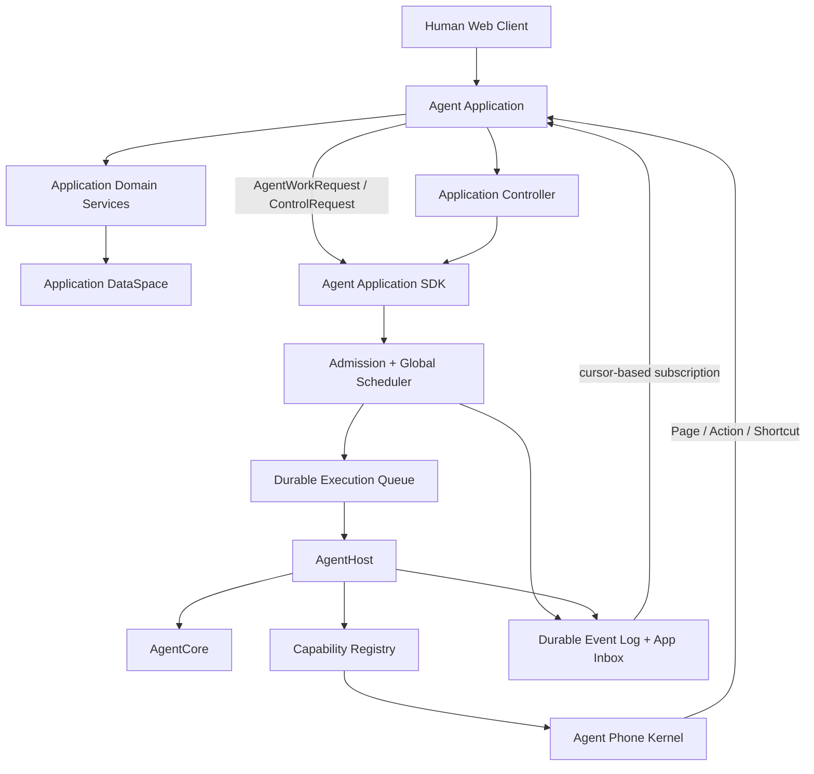

# Agent 应用平台总体架构

当前代码模块和 LOC 占比见 [`codebase-module-inventory.md`](codebase-module-inventory.md)。

> 状态：Accepted / 目标架构
> 版本：1.0
> 适用范围：Agent Runtime、Agent 应用 SDK、DataSpace、统一调度、事件投递、Agent Phone，以及 Aegis Board 的应用化与仓库拆分
> 本文是平台边界的权威规范；`agent-software-platform.md` 只描述 Phone 与 AI UI 子协议，`coordination-control-plane.md` 只描述当前实现和迁移中的可靠执行机制。

## 1. 决策摘要

Aegis 不再被定义为“以 Board Issue 为核心的多 Agent 系统”，而被拆成两类独立产品：

1. **Agent Application Platform**：提供模型无关的 Agent 执行、统一调度、事件、DataSpace、Capability、Phone 和应用 SDK；
2. **Aegis Board Application**：平台上的第一个完整应用，拥有 Task、Issue、验收、返工、Relay、协同策略、Board Agent、Board Prompt、Web UI 和 Phone UI。

其他应用，例如短视频制作、电话、客服或销售应用，与 Board 平级。它们定义自己的领域模型、数据空间、Agent、Prompt、Phone 页面和协同控制器，不需要使用或映射为 Board Issue。

应用不直接启动 Agent 进程。应用向平台提交持久化的 `AgentWorkRequest`，统一调度器完成准入、排队、调度、领取和执行，并通过持久化事件把每个生命周期阶段通知原应用。应用根据事件更新自己的业务状态或提交后续工作。

每个应用拥有独立的长期 `DataSpace`。平台负责命名空间、访问授权、事务基础设施、迁移、审计和备份接口；应用拥有数据模型与业务语义。Agent 只有在某次执行被授予明确 `DataSpaceGrant` 后才能通过 Capability 或 Phone App 访问该空间。

## 2. 目标与非目标

### 2.1 目标

- 新应用只依赖公开 SDK，不依赖 Board 或其他产品的内部包；
- 新应用能注册自己的领域存储、Agent、Prompt、Capability、Phone App、Web/API、事件处理器和协同控制器；
- 应用能异步申请 Agent 工作，并可靠观察从接收到结束的完整生命周期；
- 应用能 steer、暂停、恢复、取消或调整尚未终止的工作，但不能绕过平台授权和调度；
- 平台统一处理并发、公平性、优先级、预算、租约、重试、取消、审计和可观察性；
- 应用业务状态和 Agent 执行状态分别只有一个事实源；
- Phone 是 Agent 访问应用的通用客户端，Phone 内安装的应用与人类 Web UI 使用同一应用服务；
- 首先支持编译期注册的模块化单体，协议稳定后可无损演进为独立服务或远程应用；
- Aegis Board 应用化后保持当前用户可见行为和已有持久数据兼容；
- 核心最终成为独立项目，Board 成为引用核心的独立项目。

### 2.2 非目标

- 不要求所有领域工作都表示为 Task 或 Issue；
- 不把具体业务工作流、验收语义或默认 Agent 写入平台核心；
- 不允许应用直接修改平台的 Execution、Session 或调度数据库；
- 不承诺跨应用数据库事务；跨应用流程使用持久化事件、幂等和补偿；
- V1 不实现不受信任的 Go 动态插件、公开应用市场或任意前端代码热加载；
- 普通异步 Agent Runtime 不承担毫秒级音视频实时传输；实时应用可以注册专用 Runtime/Capability。

## 3. 核心术语

| 术语 | 定义 | 所有者 |
| --- | --- | --- |
| Application | 一个独立业务软件及其领域、UI、Agent 和协同逻辑 | 应用 |
| Application Instance | 应用在一个租户或部署中的实例 | 应用平台 |
| DataSpace | 应用长期数据的隔离命名空间 | 应用拥有语义，平台提供基础设施 |
| Scope | 应用内的一组业务边界，例如 Board Task 或视频 Project | 应用 |
| Agent Profile | 可复用的模型、角色 Prompt、能力和权限声明 | 应用或独立 Agent Pack |
| Agent Work | 应用请求平台完成的一项逻辑工作 | 调度器 |
| Execution | 对一项 Agent Work 的一次完整执行 | Runtime |
| Attempt | Execution 因瞬态错误而产生的一次领取和运行尝试 | 调度器 |
| Session | 可跨 Execution 延续的模型对话和 checkpoint | Runtime |
| Controller | 消费应用/平台事件并提交新 Work 或应用命令的协同逻辑 | 应用 |
| Capability | 执行期物化的 Tool、Skill、MCP、Phone、Web 或其他资源 | 平台注册表 |
| Phone | Agent 访问已授权应用的会话、导航和审计容器 | 平台 |

## 4. 总体架构



平台允许两种应用调用方向，但两者都经过公开合同：

- **Application → Agent**：应用提交工作或控制请求；
- **Agent → Application**：Agent 通过 Phone App 或应用提供的 Capability 查询和修改业务状态。

任何一方都不能直接写另一方的私有数据库。

## 5. 所有权与事实源

### 5.1 平台核心拥有

- Agent Work 的准入、队列、调度和终止状态；
- Execution、Attempt、Lease、Session、Checkpoint；
- Provider 和 Capability 的执行期物化；
- 全局并发、公平性、优先级、预算和限流；
- 平台事件日志、App Inbox、cursor 和投递审计；
- Phone Session、安装列表、导航、草稿、幂等结果和访问审计；
- DataSpace 注册、连接、命名空间和授权合同；
- 与业务无关的日志、trace、metrics、artifact 和 secret 引用。

### 5.2 应用拥有

- 领域实体、业务状态机和数据库 schema；
- 什么业务变化需要请求 Agent；
- 如何根据 Agent 事件推进领域状态；
- Agent Profile、角色 Prompt、领域 Skill 和默认能力；
- 应用协同 Controller；
- 人类 Web UI、Agent Phone UI 和应用 API；
- 领域验收、返工、审批、报告和通知语义；
- 应用内部审计事实和对平台 Execution 的绑定。

### 5.3 禁止双重状态所有权

应用业务记录只保存平台引用，不复制平台状态机：

```text
Application Business Object
    workRequestId -> Agent Work
    executionId   -> current Execution（可选投影）
```

平台不保存 `IssueStatus`、`ValidationPassed`、`VideoPublished` 等领域状态。应用可以缓存平台状态用于查询，但必须通过事件更新并能从平台事件重建。

Board 当前同时存在业务 `Execution` 与 Coordination `Execution`。迁移时必须明确：Board 业务记录保存展示、证据和领域结果；平台 Execution 是运行生命周期的唯一事实源。

## 6. Application Extension 合同

### 6.1 应用清单

```go
type ApplicationManifest struct {
    ID            string
    Version       string
    DisplayName   string
    SDKVersion    string
    DataSpaces    []DataSpaceDescriptor
    RequestedCaps []Permission
    Web           WebManifest
    Phone         PhoneManifest
}
```

应用 ID 使用反向域名或稳定命名空间，例如：

```text
aegis.board
media.shortvideo
communication.calling
```

### 6.2 编译期注册接口

```go
type Application interface {
    Manifest() ApplicationManifest
    Register(context.Context, ApplicationContext) error
}

type ApplicationContext interface {
    Agents() AgentProfileRegistry
    Prompts() PromptRegistry
    Capabilities() CapabilityRegistry
    PhoneApps() PhoneAppRegistry
    Controllers() ControllerRegistry
    DataSpaces() DataSpaceRegistry
    HTTP() HTTPRegistry
    Events() ApplicationEventRegistry
}
```

`Register` 只能注册描述符、工厂和 handler，不能在注册阶段启动后台 goroutine 或执行数据库副作用。应用启动、迁移和停止由平台生命周期管理。

### 6.3 独立注册表而非 God Interface

平台内部保持小接口：

```go
type AgentProfileProvider interface { AgentProfiles() []AgentProfile }
type PromptProvider interface { PromptContributors() []PromptContributor }
type CapabilityProvider interface { Capabilities() []CapabilityRegistration }
type PhoneAppProvider interface { PhoneApps() []phone.App }
type ControllerProvider interface { Controllers() []ControllerRegistration }
```

`Application` 只是部署和生命周期聚合器。单元测试可以独立测试每个 provider。

## 7. DataSpace

### 7.1 定义

DataSpace 是持久化的数据命名空间，不是进程内存。服务重启、Execution 重试、Agent 更换后仍然存在。应用可以选择关系型、KV、文档、向量或 Blob 端口，但平台不要求所有应用使用同一种物理数据库。

```go
type DataSpaceDescriptor struct {
    Name       string
    Version    string
    Kinds      []DataKind
    Migrations []Migration
    Retention  RetentionPolicy
}

type DataSpaceGrant struct {
    AppID      string
    Space      string
    TenantID   string
    ScopeID    string
    SubjectID  string
    Actions    []string
    ExpiresAt  time.Time
}
```

### 7.2 推荐层级

```text
Application DataSpace
  ├─ application-global
  ├─ tenant
  ├─ scope/project/task
  ├─ agent-profile-memory
  ├─ agent-instance-memory
  └─ execution-temporary
```

- `application-global`：应用配置和公共目录，默认不向 Agent 开放写权限；
- `tenant`：租户长期数据，禁止跨租户授权；
- `scope`：一次项目、Task、Case 或 Campaign 的共享业务数据；
- `agent-profile-memory`：明确允许跨工作复用的角色记忆，必须有保留和删除策略；
- `agent-instance-memory`：一个应用 scope 内的 Agent 实例私有记忆；
- `execution-temporary`：Execution 结束后可清理的临时数据。

### 7.3 隔离与访问

- 默认拒绝跨应用、跨租户和跨 scope 访问；
- 应用服务可通过平台提供的 scoped connection 访问自己的空间；
- Agent 只能通过本次 Execution 快照中的 `DataSpaceGrant` 访问；
- Phone 页面和 Capability 必须再次执行应用级行权限检查；
- 跨应用共享通过显式 `DataLink`、复制/导出或授权 API，不共享数据库表；
- 原始 secret 不进入 DataSpace Grant 或 Agent prompt；
- 每次写入记录 application、actor、scope、request、execution 和 trace 关联字段；
- schema 迁移必须版本化、幂等，并在应用启动前完成兼容性检查。

### 7.4 存储端口

V1 至少定义：

```go
type DataSpaceManager interface {
    Register(context.Context, string, DataSpaceDescriptor) error
    Open(context.Context, DataSpaceRef, Actor) (DataSpaceSession, error)
}

type DataSpaceSession interface {
    SQL() SQLExecutor                 // 可选
    KV() KeyValueStore                // 可选
    Documents() DocumentStore         // 可选
    Blobs() BlobStore                 // 可选
    Vectors() VectorStore             // 可选
    Close() error
}
```

未声明的 Kind 返回明确的 `unsupported`，不能静默落到宿主文件系统。

## 8. Agent Work 请求

### 8.1 请求合同

```go
type AgentWorkRequest struct {
    AppID          string
    TenantID       string
    ScopeID        string
    CorrelationID  string
    IdempotencyKey string

    AgentProfileID string
    SessionKey     string
    Prompt         string
    Priority       int
    StartAfter     *time.Time
    Deadline       *time.Time
    Budget         ExecutionBudget

    Capabilities   []capability.Ref
    DataSpaces     []DataSpaceGrant
    InstalledApps  []string
    Metadata       map[string]string
}

type AgentWorkReceipt struct {
    RequestID string
    WorkID    string
    Status    string // accepted | rejected
    Reason    string
}
```

`accepted` 只表示身份、格式、策略和静态依赖校验通过，不表示已经选中 Worker 或开始模型调用。

### 8.2 标识符

| 标识符 | 生命周期 | 用途 |
| --- | --- | --- |
| `requestId` | 一次 SDK 请求 | API 幂等和请求审计 |
| `workId` | 一项逻辑 Agent 工作 | 排队、控制和最终结果 |
| `executionId` | 一次 Agent 执行 | Session、事件和能力快照 |
| `attemptId` | 一次 Worker 领取 | retry、lease 和错误诊断 |
| `sessionId` | 可延续对话 | continuation/resume |
| `correlationId` | 应用定义 | 关联 Issue、ScriptJob 等业务对象 |

应用不能把这些 ID 合并为一个字段。一次 Work 可以有多个 Attempt；应用显式继续或重新运行时可以创建新的 Execution，但仍能通过 Correlation ID 归属于同一业务对象。

## 9. 统一调度与控制

### 9.1 应用看到的 SDK

```go
type AgentWorkService interface {
    Request(context.Context, AgentWorkRequest) (AgentWorkReceipt, error)
    Get(context.Context, string) (AgentWorkView, error)
    Steer(context.Context, SteerRequest) (ControlReceipt, error)
    Suspend(context.Context, ControlRequest) (ControlReceipt, error)
    Resume(context.Context, ResumeRequest) (ControlReceipt, error)
    Cancel(context.Context, CancelRequest) (ControlReceipt, error)
    ChangePriority(context.Context, PriorityRequest) (ControlReceipt, error)
}
```

控制 API 返回“控制请求已接受”，应用仍然等待对应的终态或状态变更事件。例如 `Cancel` 返回成功不能直接证明模型 loop 已停止。

### 9.2 调度器拥有

- 全局、租户、应用和 Provider 并发；
- 公平调度与防饥饿；
- 优先级、`startAfter` 和 deadline；
- Agent Profile 与 Capability 可用性；
- 模型额度、成本和 Work Budget；
- Worker 选择、lease、fencing token 和 heartbeat；
- 瞬态错误 retry 和退避；
- cancel、shutdown 和恢复；
- Execution 与 Attempt 的生命周期事件。

应用只能提供调度意图，不能指定未经授权的 Worker、跳过队列或提高到超出策略的优先级。

### 9.3 Controller

Controller 是应用内的事件驱动协同逻辑：

```go
type Controller interface {
    Handle(context.Context, ApplicationEvent, ControllerContext) error
}

type ControllerContext interface {
    AgentWork() AgentWorkService
    Commands() ApplicationCommandBus
    Timers() TimerService
    DataSpaces() DataSpaceManager
}
```

Controller 可以是：

- 确定性状态机；
- DAG/流水线；
- Manager/Worker；
- 使用专门 Orchestrator Agent 做决策的混合控制器；
- 人工审批和 Agent 决策组合。

业务硬约束必须由代码和 policy 执行，不能只依赖 Prompt。

## 10. 生命周期事件

### 10.1 Event Envelope

```go
type ApplicationEvent struct {
    EventID       string
    Sequence      int64
    Type          string
    OccurredAt    time.Time

    AppID         string
    TenantID      string
    ScopeID       string
    CorrelationID string
    RequestID     string
    WorkID        string
    ExecutionID   string
    AttemptID     string
    TraceID       string

    Payload       json.RawMessage
}
```

### 10.2 必需事件

```text
agent.work.requested
agent.work.accepted
agent.work.rejected
agent.work.queued
agent.work.scheduled
agent.work.claimed
agent.work.started
agent.work.progress
agent.work.waiting
agent.work.suspended
agent.work.resumed
agent.work.steered
agent.work.retry_scheduled
agent.work.attempt_failed
agent.work.completed
agent.work.failed
agent.work.cancelled
agent.work.expired

agent.control.requested
agent.control.accepted
agent.control.rejected

application.timer.fired
application.notification.created
```

事件含义：

| 事件 | 保证 |
| --- | --- |
| `accepted` | 请求通过准入校验并获得 Work ID |
| `queued` | Work 已持久化，重启后仍会存在 |
| `scheduled` | 调度器已为 Work 做出一次可执行调度决定 |
| `claimed` | Worker 使用 lease/fencing token 原子领取 |
| `started` | AgentHost 已开始物化并运行 Agent |
| `completed` | Runtime 成功终止并保存结果 |
| `failed` | Work 不再自动重试，应用需要决定后续动作 |

### 10.3 投递语义

- Event Log 和 App Inbox 都是持久化的；
- 使用 **at-least-once**，不宣称 exactly-once；
- 每个 App/Scope 有单调递增 sequence 和可恢复 cursor；
- handler 必须按 `eventId` 幂等；
- 领域写入和下一事件使用 transactional outbox；
- 支持从 cursor 重放、dead-letter、人工重试和消费滞后指标；
- Webhook、SSE 或进程内订阅只是投递 transport，不是事实源；
- 高频 token delta 不直接进入 App Inbox，先聚合成可消费的进度事件。

### 10.4 订阅接口

```go
type ApplicationEventService interface {
    Subscribe(context.Context, EventFilter, Cursor) (EventStream, error)
    Replay(context.Context, EventFilter, Cursor, int) ([]ApplicationEvent, Cursor, error)
    Ack(context.Context, SubscriptionID, Cursor) error
}
```

应用重启后从已确认 cursor 继续，不依赖进程内 channel。

## 11. Phone 与应用的双向合同

Phone Kernel 属于平台，包含：

- App manifest 和安装列表；
- Actor、scope 和 token；
- 页面栈、REF、revision、草稿和导航；
- Action/Shortcut 幂等；
- 权限、审计和恢复；
- `phone_view`、`phone_action`、`phone_back`、`phone_home` 等稳定工具。

具体 Phone App 属于应用。Board Phone UI 只能调用 Board Application Service；短视频 Phone UI 只能调用短视频 Application Service。Phone 页面不能直接启动 Agent，除非应用命令在领域层明确接受该动作并通过 Agent Work SDK 提交请求。

应用可以在请求 Agent 时声明 `InstalledApps`，平台与 policy 计算最终安装列表。Agent 不会因为安装某 App 自动获得其所有 DataSpace 权限。

Phone 和 Web 是同一应用服务的两种 presenter：

```text
Application Query/Command Service
    ├─ Web/API presenter
    └─ Phone AI-page presenter
```

详细页面、REF 和动作协议见 `agent-software-platform.md`。

## 12. Agent Profile 与 Prompt

### 12.1 Agent Profile

```go
type AgentProfile struct {
    ID             string
    Version        string
    OwnerAppID     string
    Model          ModelRef
    RolePrompt     PromptRef
    Capabilities   []capability.Ref
    DataSpaceRules []DataSpaceRule
    AppRules       []AppInstallRule
    Permissions    PermissionBoundary
}
```

平台提供 Profile Registry 和解析，不内置“后端工程师”“红队负责人”等业务角色。通用 Profile 可以由独立 Agent Pack 提供，Board 默认团队由 Board 应用或其依赖的 Agent Pack 提供。

### 12.2 Prompt Pipeline

Prompt 使用版本化 section 组装：

```text
1. platform.identity-and-safety      平台强制，应用不可覆盖
2. platform.execution-contract      平台强制
3. application.operating-contract   应用提供
4. controller.coordination-context  Controller 提供
5. agent.role                       Agent Profile 提供
6. capability.instructions          执行期物化
7. application.scope-context        应用提供
8. user/work prompt                 Work Request 提供
```

每个 section 保存 `id/version/owner/trust/order/hash`。Execution 快照记录实际 Prompt sections，保证升级后仍可解释历史结果。应用 Prompt 不能修改平台权限、预算或安全事实。

## 13. 安全与资源治理

- 所有应用调用绑定 app、tenant、scope、actor 和 trace；
- Work Request 先做应用身份、Agent Profile、Capability、DataSpace、预算和优先级校验；
- 原始凭据只存在于 Secret/Vault adapter，以引用交给 Capability；
- 应用不能直接读取其他应用 Inbox、DataSpace、Phone 或 Execution 私有上下文；
- 跨应用调用必须使用声明式 permission 和显式 grant；
- Phone 文本、应用数据和外部事件都是不可信输入；
- 高风险副作用由 Capability 或应用 command handler 强制审批；
- 防止 App→Agent→App 无限循环：每个事件链携带 trace、depth、budget 和 rate limit；
- 调度器按应用和租户实施配额，避免单个应用耗尽所有 Agent；
- 动态远程应用必须使用独立进程/容器、签名 manifest 和受限网络，不使用不受信任 Go plugin。

## 14. 可观察性

每个请求和事件至少关联：

```text
appId tenantId scopeId correlationId
requestId workId executionId attemptId sessionId
eventId traceId
```

核心指标：

- 请求接受/拒绝率及原因；
- queue latency、schedule latency、start latency；
- 每 App/租户运行数、排队数、公平性和饥饿时间；
- Attempt retry、lease loss、cancel latency；
- App Inbox lag、重复投递、dead-letter；
- DataSpace 权限拒绝、读写延迟和迁移状态；
- Phone 动作成功率和跨 App 越权尝试；
- token、成本、预算终止和 Provider 可用性。

## 15. Aegis Board 应用边界

### 15.1 Board 拥有

Board 是一个独立应用 `aegis.board`。以下全部属于 Board，而不是平台核心：

- Project、Task、TaskTemplate、Issue、IssueRelation；
- TaskAgent 及 Board 内的团队和分派语义；
- Issue checkout、状态、优先级、依赖、树、取消和删除；
- Issue Execution 的业务投影、交付结果和证据关联；
- Validation、返工、人工复核、Task Audit 和报告；
- Comment、mention、Relay、广播和 Board 通知；
- `board_autonomy` Controller、心跳、sleep、wakeup 和父子结果路由；
- Board 默认 Agent、Prompt、Skill、知识库绑定和预算规则；
- Board Web/API、Phone 页面、快捷指令和审计；
- Board DataSpace schema 与 migration。

Relay 可以继续作为 Board 内部子模块和 Phone 页面，但在 V1 不作为平台强制安装的独立应用。未来若 Relay 需要服务多个应用，再通过跨应用消息合同独立化。

### 15.2 Board 不拥有

- Agent loop、Provider 连接和工具循环；
- 通用 Execution queue、lease、retry、cancel；
- 全局调度公平性与应用配额；
- Capability 和 Phone Kernel；
- App Event Log/Inbox；
- DataSpace 基础设施和 Secret；
- 通用 Session、Artifact 和 observability。

### 15.3 Board 事件闭环

```mermaid
sequenceDiagram
    participant U as User or Board Agent
    participant B as Board Application
    participant S as Agent Work SDK
    participant R as Scheduler and Runtime
    participant I as Board App Inbox

    U->>B: assign Issue
    B->>B: persist Issue transition + outbox
    B->>S: AgentWorkRequest(correlationId=issueId)
    S-->>B: accepted(requestId, workId)
    R-->>I: queued / scheduled / claimed / started
    I->>B: update Board execution projection
    R-->>I: progress / completed
    I->>B: save delivery and start Board validation rule
    B->>S: validation AgentWorkRequest
    R-->>I: validation completed
    I->>B: pass -> done; reject -> rework request
```

### 15.4 当前代码迁移映射

| 当前位置 | 目标位置 |
| --- | --- |
| `agenthost`, `capability`, `provider`, `storage` | 平台核心 |
| `coordination/execution*`, 通用 repository/worker | 平台调度核心 |
| `coordination/engine`, inbox/outbox/timer | 平台事件与 Controller Kernel |
| `coordination/modes/board_autonomy.go` | Board Controller |
| `agentapp` 的协议、Phone Session、审计、adapter | Phone Kernel |
| `apps/board/phone/board.go`, `relay.go` | Board Phone 模块（已迁移） |
| `apps/board/control` 的 Task/Issue/Validation/Relay | Board domain/application |
| `apps/board/control` 的默认 Agent 与 Board Prompt | Board Agent/Prompt pack |
| `apps/board/control/native_runner.go` 的通用 spec 物化 | 平台 adapter |
| `apps/board/control/native_runner.go` 的 Board prompt/状态 | Board execution adapter |
| `cmd/server` 的通用启动与注册 | 平台 host |
| `cmd/server` 的 Board API | Board HTTP adapter |
| `src` 的 Board 页面 | Board Web application |

## 16. 仓库与依赖目标

### 16.1 迁移期单仓库

```text
aegis/
  platform/
    app/
    dataspace/
    events/
    scheduler/
    phone/
    runtime/
  apps/
    board/
      domain/
      application/
      controller/
      agents/
      prompts/
      phone/
      adapters/
  cmd/server/
  src/
```

依赖规则：

```text
platform 不能 import apps/board 或 apps/board/control
apps/board 可以 import platform SDK
cmd/server 同时 import platform 和 apps/board，只做组合
```

### 16.2 最终双项目

核心项目：

```text
agentplatform/
  app SDK
  DataSpace
  event/inbox
  scheduler
  AgentHost/Capability
  Phone Kernel
  provider/storage/observability ports
  conformance tests
```

Board 项目：

```text
aegis-board/
  go.mod -> require agentplatform
  Board domain + DataSpace
  Board Controller
  Board Agent/Prompt pack
  Board Phone App
  Board HTTP/Web UI
  composition root
```

V1 使用 Go module 版本引用，不使用源码复制。开发期可临时使用 `go.work` 或受控 `replace`，发布和 CI 必须验证无本地 `replace` 也能构建。

## 17. 实施计划与提交边界

### Phase 1：规范冻结

- 接受本文作为权威边界；
- 补充 SDK、Event、DataSpace 和 Board manifest 的可编译合同；
- 为当前行为建立 characterization tests；
- 标记旧文档中与本文冲突的 Board 内置假设。

验收：所有核心概念、状态所有权、事件和仓库目标都有唯一解释，现有文档无相反的规范性要求。

### Phase 2：当前仓库中的 Board 应用化

- 建立 `platform` 和 `apps/board` 包边界；
- 将 Board/Relay Phone App 移入 Board；
- 将 Task、Issue、Validation、返工、报告和协同 Controller 移入 Board；
- 引入 Agent Work Gateway 和 App Event Inbox；
- Board 通过 SDK 请求工作并消费生命周期事件；
- 将默认 Agent 和 Board Prompt 迁入 Board pack；
- 保留当前 SQLite 数据兼容和 Web/API 行为。

验收：移除 Board 注册后，平台核心仍可独立构建和测试；注册 Board 后，现有功能和数据继续工作。

### Commit Gate：应用化提交

只在 Phase 1 和 Phase 2 同时完成并通过以下检查后提交：

- Go 全量测试；
- React typecheck/build；
- Board 关键 API 和 Agent 协同集成测试；
- migration 前后兼容测试；
- import-boundary 检查；
- 工作树中只暂存本目标相关文件，不混入用户已有改动。

### Phase 3：核心独立项目

- 将平台包迁移到独立 `agentplatform` 项目；
- 发布本地/远端可引用 module 版本；
- 在核心项目运行 conformance、scheduler、Phone 和 DataSpace 测试；
- 核心仓库不得出现 Board、Issue、Validation、Relay 领域类型。

### Phase 4：Board 独立项目

- 新建 `aegis-board` 项目；
- 引用 `agentplatform` module；
- 迁移 Board DataSpace、Controller、Phone、API、Web 和 Agent pack；
- 提供数据迁移与启动说明；
- 验证与拆分前相同的主要用户效果。

## 18. 测试与完成标准

### 18.1 平台契约测试

- App 注册重复 ID、版本不兼容和部分失败回滚；
- DataSpace namespace、tenant/scope 隔离和 migration；
- Work Request 幂等、拒绝、排队、调度、领取、重试、取消；
- 每个必需生命周期事件的顺序、字段和持久化；
- App Inbox 重启续订、重复事件、cursor、dead-letter；
- Capability/DataSpace/Phone 权限快照；
- 不注册 Board 时核心测试通过。

### 18.2 Board characterization

- 创建根任务和子 Issue；
- 分配 TaskAgent 并启动工作；
- Phone Board 查询、委派、评论、sleep 和 Relay；
- 子 Issue 完成后父 Agent 收到通知；
- 验收通过、返工和人工复核；
- 预算、取消、恢复和证据导出；
- 旧数据库启动、查询和继续执行；
- 当前主要 React 页面和 API 合同保持兼容。

### 18.3 最终完成判据

- [ ] 平台核心项目可以独立 clone、build、test；
- [ ] 平台核心源码不包含 Board/Issue/Validation/Relay 业务语义；
- [ ] Board 项目通过正式 module 依赖核心，而不是复制源码；
- [ ] Board 是普通 Application 注册，不享有未公开的核心入口；
- [ ] Board 拥有自己的 DataSpace、Controller、Agent、Prompt、Phone 和 Web；
- [ ] Board 只通过 Agent Work SDK 请求 Agent；
- [ ] Board 能接收 requested、accepted、queued、scheduled、claimed、started 和终态事件；
- [ ] 服务重启后 Board 从 App Inbox cursor 继续消费；
- [ ] 注册一个最小示例 App 无需修改平台核心；
- [ ] 拆分前的 Board 关键行为、数据兼容、构建和测试均有证据。

## 19. 架构约束

以下约束作为 code review 和 CI import 检查规则：

1. 平台核心不得 import 具体应用；
2. 调度核心不得包含 Issue、视频、电话等领域字段；
3. 应用不得直接写平台 Execution/Session/Event 表；
4. 应用不得直接启动 AgentHost，必须提交 Agent Work；
5. Agent 不得直接访问应用数据库，必须经授权的 Phone/Capability；
6. 应用业务状态只能由应用 command/controller 修改；
7. Work/Execution 状态只能由平台调度和 Runtime 修改；
8. 所有跨边界副作用都必须幂等并产生审计事件；
9. 所有长期处理都必须可从持久化状态恢复；
10. Prompt 不能代替权限、预算、审批或业务状态机。

这十条约束比目录名称更重要。只有依赖方向和状态所有权真实成立，代码移动才算完成应用化和框架化。
