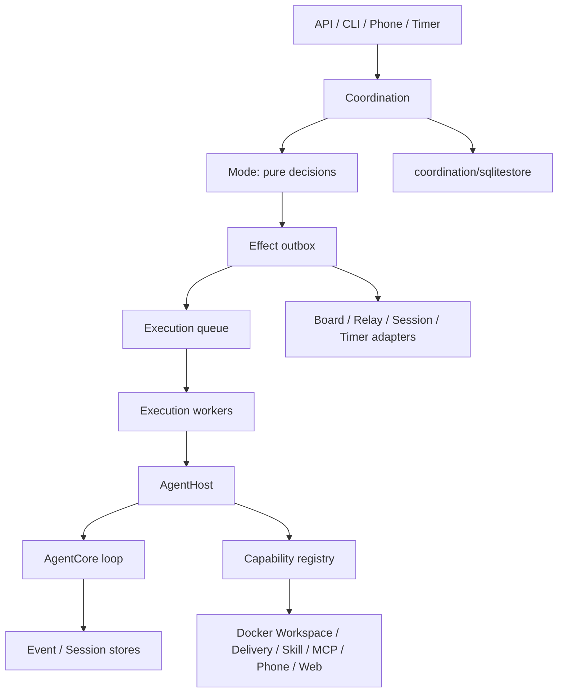

# Go Agent Runtime 模块边界

> 状态：原生 Go Agent loop、能力系统、协同决策、可靠执行和 SQLite 持久化已接入 Aegis。独立 Scheduler、兼容 Runner、切流开关和 legacy coordination mode 已删除。

## 架构

`coordination` 是唯一执行控制面。它内部明确区分两类机制：Mode/Event/Effect 负责协作决策，Execution/Worker 负责排队、租约、重试、取消和调用 Runner。它们共用 Coordination ID 和同一个所有权边界，因此不会出现 Issue、协作任务和 Job 三套互相竞争的状态机。

人类管理端与领域模块的边界见 [`ui-and-domain-boundaries.md`](ui-and-domain-boundaries.md)。

依赖方向固定为 `coordination -> agenthost -> agentcore`。`agentcore` 不知道 Coordination、SQLite、Phone、Skill、MCP 或 HTTP；`agenthost` 是唯一把声明式 `ExecutionSpec` 物化成一次 Agent 运行的地方。

## 模块

### 独立仓库 `github.com/z3r2ne/agentcore`

Provider 无关的 Agent loop，包括流式模型响应、工具循环、工具并发策略、重试、上下文策略、事件、Session 和 checkpoint。它是独立 Git 仓库与 Go module，不包含 Aegis 领域依赖。调用方可用 Builder 按执行装配自定义 Tool、动态 Skill 和有序 Interceptor；模型/工具调用前后、下一轮配置与停止判断都可拦截。每个工具调用都有稳定的 `ToolInvocation`，副作用工具可使用 Execution ID 与 Tool Call ID 实现幂等。

### `agenthost`

一次 Agent 执行的宿主。它解析模型与能力，把可信 Skill 指令组合进 system prompt，运行 `agentcore.Agent`，并保证释放 MCP、浏览器等执行级资源。它不负责排队、协作模式或业务 Issue 状态。

### `capability`

能力引用和运行期 Source 注册表。持久化数据只包含 `kind/name/version/config`；Source 在执行时生成工具、可信指令、资源关闭器与可复现快照。Registry 检测工具重名，并在失败时逆序释放已经创建的资源。

### `coordination`

协同与执行控制平面，包含四个相互独立的部分：

- `Mode.Decide`：无副作用地把 Event 转成 Planned Effect；
- Engine/Effect Worker：事务化 inbox/outbox、延迟唤醒和副作用适配；
- `CapabilityPlanner`：合并 Agent 默认能力、delegation 请求、系统必需能力和 Task allow/deny/required 策略；
- `ExecutionQueue`/`ExecutionWorker`：可靠保存并领取执行，维护重试、租约心跳、fencing token、取消和结果。

运行时只注册 `board_autonomy`。它通过 Phone Board 创建和指派子 Issue，父 Agent 始终可以继续工作；一分钟心跳由持久化 delayed effect 驱动，`phone_board_sleep`、Board 评论和 Relay/Phone 消息共享同一套唤醒/steer 通道。Mode 不能直接调用模型、写 Board 或启动 Agent。

### `agentapp` 与 Phone

`agentapp` 是独立的 Agent Phone 模块。每个 `TaskAgent` 拥有一部仅在该 Task 内有效的 Phone；同一 Agent 类型的两个任务实例具有不同会话、导航、草稿、收件箱和审计记录。`agentapp/agentcoreadapter` 把 Phone 转成 `phone_view`、`phone_action`、`phone_back`、`phone_home` 四个工具。Aegis 默认在进程内提供 Board/Relay App，也可通过 `AEGIS_AGENTAPP_URL` 使用远程 transport。

### `skill` / `mcp` / `web` / `provider`

- Skill Source 解析版本化可信指令并生成内容摘要快照；
- MCP Source 管理执行级连接、工具发现和关闭生命周期；
- Web Source 隔离搜索配置与凭据；
- provider resolver 根据声明式模型引用生成 `agentcore.Model`。

### `workspace` 与任务容器

每个 Task 创建时分配一个专属 Docker named volume，固定挂载到任务容器的 `/workspace`。同一 Task 树的全部 Agent 和 Execution 复用该卷；子 Issue 不创建私有目录或新卷，不同 Task 之间则以容器和卷隔离。

`workspace.DockerSource` 提供 `bash/read/write/edit/grep/find/ls`。所有命令和文件操作都通过 `docker exec` 进入 Task 容器，没有宿主机执行或宿主机工作区回退。`NativeDeliverySource` 提供进度、最终结果和附件发布；附件只能从 `/workspace` 内的普通文件读取，并直接写入 Aegis 附件存储。任务工作区 API 只返回逻辑根，不枚举或复制卷内容。

### `storage` / `observability`

`storage` 提供事件与 Artifact 端口；`observability` 提供结构化日志、脱敏、关联上下文、轻量 trace 与指标。任务证据导出会收集业务 Execution、Coordination Execution、完整对话、工具事件、协作记录和相关日志。

## SQLite 所有权

- `coordination/sqlitestore`：binding、event inbox、effect outbox、timer、Execution、attempt、lease 与结果；
- 独立 `agentcore/sqlitestore`：Agent Session/checkpoint；
- `storage/sqlitestore`：可重连的连续 Agent 事件流；
- `agentapp.GormStore`：以 `taskId + taskAgentId` 隔离 Phone Session、页面私有 REF、幂等动作和审计；
- Aegis control store：Task、Issue、业务 Execution、消息、验收和附件。

适配器可以共用一个 SQLite 连接，但核心包不导入 GORM。SQLite 文件启用 WAL、busy timeout，并以 `0600` 创建。

## Aegis 组合根

`cmd/server` 在启动时只做依赖装配：

1. 打开 Store 与日志系统；
2. 注册 model resolver 和 capability sources；
3. 创建 AgentHost；
4. 创建 Coordination repository、Engine、ExecutionQueue 和 Workers；
5. 把公开 Issue dispatch、Agent delegation、Board/Relay event 和 timer 统一送入 Coordination；
6. 关闭时停止领取、取消上下文并等待 Worker。

不存在 Scheduler feature flag、Native feature flag、兼容 Runner 或另一条直接 Issue 执行链。`runtimeapp` 提供同一架构的可嵌入组合方式。

## 关键约束

- Coordination 持久化数据必须可 JSON 编码，不得保存客户端、连接对象或原始 secret；
- Claim、Renew、Complete、Retry、Fail 必须原子更新并验证 fencing token；
- 有副作用的工具使用 `ExecutionID + ToolCallID` 或等价键保证幂等；
- Capability 返回的 Phone 页面、网页和 MCP 数据属于不可信工具输出；
- Mode 只做纯决策，所有外部副作用都经过持久化 outbox；
- 核心领域定义接口，SQLite/GORM adapter 实现接口，不能反向依赖。

## 尚未产品化的扩展

- MCP Server 的 UI、持久化 CRUD 和默认 stdio/HTTP Connector；
- 多租户身份、外部 Vault adapter、provider 级限流与 fallback；
- 每 Agent/租户公平调度与分布式指标后端；
- 分布式 worker transport：当前 AgentCore/model loop 在控制平面进程内，项目命令和文件 I/O 已全部进入 Task 容器；若未来要求连模型客户端和 loop 进程也位于远端容器，可在 AgentHost 后增加 worker transport，而无需改变 Workspace、Coordination 或 Store 边界。
