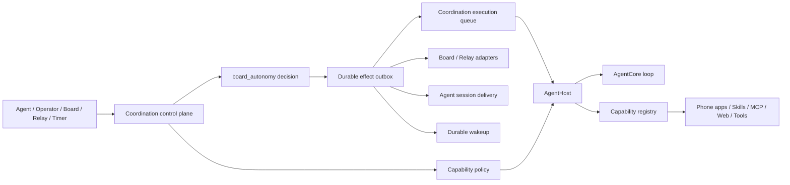

# Coordination 控制平面

## 责任边界

Coordination 是编排逻辑的单一入口，但不是一个吞掉所有实现的巨型包。它拥有决策，其他模块拥有机制：

| 责任 | 所有者 |
| --- | --- |
| 选择协同模式、父子关系、继续或等待、结果路由 | Coordination Mode |
| 决定一次 Agent 执行可见的插件、Skill、软件和工具 | Coordination CapabilityPlanner |
| 接收主动调用、Board 事件、Relay 事件、定时唤醒 | Coordination gateway |
| 可靠保存决策、重试副作用 | Coordination inbox/outbox |
| 排队、租约、重试、取消、调用 Runner | Coordination Execution |
| 解析模型与 capability、运行 Agent loop | AgentHost / AgentCore |
| 提供 Board、Relay 等软件行为 | Agent Phone App |
| 建立 MCP 连接和发现工具 | MCP Connector |
| 保存业务、执行与审计事实 | 各 Store adapter |

当前产品只注册 `board_autonomy`；若未来替换协作策略，决策代码仍只需实现纯 `Mode.Decide`。“新插件/软件”只实现 `capability.Source` 或注册 Phone App；两者不互相依赖。

## 一次执行的授权链

1. Agent 定义给出默认 Skill、Web、Phone 等能力。
2. delegation/Issue 可选择 `inherit`、`merge` 或 `replace` 并携带 capability refs。
3. Task 根 binding 的 `capabilityPolicy` 进行 allow、deny、required 和数量限制。
4. Coordination 强制加入 `workspace`、`delivery` 和 `coordination` 三个系统能力并确认 Source 已注册；Agent 的 `replace` 也不能移除它们。
5. Coordination Execution 只持久化批准后的声明式 refs。
6. AgentHost 在执行作用域内 materialize refs，工具白名单来自实际 bundle。
7. Execution 保存真实 capability snapshots；日志记录批准/拒绝，任务证据包完整导出。

任何 capability config 中的原始凭据都会在计划阶段被拒绝。连接凭据应保存于 Secret/Vault adapter，以引用形式交给 Source 解析。

## 当前完成与产品化缺口

控制平面的核心链路统一为 Board Issue，公开 Issue dispatch 也走 Coordination。内置 Board/Relay Phone、动态 Skill 与外部 Source 注册都有测试。

尚未产品化的是 MCP Server 的设置页、持久化 CRUD 和一种默认 transport Connector。这不影响库级扩展：嵌入程序可通过 `NativeHostOptions.Sources` 注入 `mcp.Source`；但若目标是让非开发者在 UI 中安装任意 MCP，还需要单独实现配置与 Secret 管理界面。
