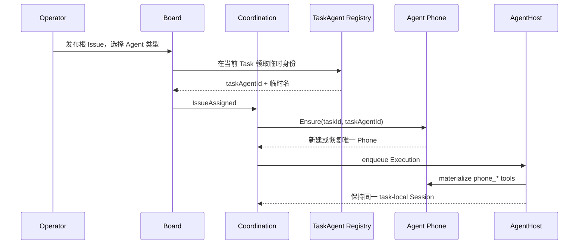

# UI 与领域边界

> 当前实现说明。目标应用边界见 [`agent-application-platform.md`](agent-application-platform.md)。最终 React shell 负责组合已注册应用；Task、Issue、验收、Relay 及其页面属于 Board Web Application，不是平台固定导航或领域。

## 产品信息架构

当前所有人类操作界面由 `src/` 下的 React 应用统一组合。目标状态仍保留统一 shell，但应用注册自己的路由、导航和页面 bundle；Go 平台不固定 Board 信息架构，`cmd/server` 只负责平台与应用装配和 HTTP 适配。

左侧导航按使用者的工作心智分成三组：

- **工作**：概览、管家、任务、计划树、时间线；
- **Agent 与能力**：Agent 类型、能力控制台、Skills、知识库；
- **运行与安全**：审批、执行会话、环境与容器、安全态势和安全工具。

不再提供部门、职位、员工名册、人才模板或全局员工工作区。`Agent` 只表示可复用角色类型；真实参与一次任务的是运行时创建的 `TaskAgent`。

## UI 和业务逻辑分别放在哪里

| 场景 | React UI | 领域逻辑 | 持久化 |
| --- | --- | --- | --- |
| 编辑 Agent 类型默认能力 | `src/pages/agents.tsx` | `apps/board/control/agent_types.go`、Store Agent API | `agents` |
| 查看能力注册与最终能力包 | `src/pages/capabilities.tsx` | `coordination.CapabilityPlanner`、`capability.Registry` | Coordination binding / Execution snapshot |
| 创建任务并选择根 Agent 类型 | `src/pages/task-new.tsx` | Store 创建根 Issue，Coordination 接管分配 | `issues`、`task_agents`、Coordination tables |
| 查看任务编队和每台 Phone | `src/pages/task-detail.tsx` | `TaskAgents`、`TaskPhones` 查询 | `task_agents`、`agent_app_phone_sessions` |
| 评论、查看子 Issue、干预执行 | `src/pages/board-issue-detail.tsx` | Board repository、Coordination gateway | comments、events/effects、Relay |
| 绑定 Skill / 知识库 | Agent 类型编辑器 | Agent 定义保存与 CapabilityPlanner 合并 | Agent refs、Skill/KB tables |

UI 只能提交意图，不能自己决定 Agent 最终能获得什么能力。例如把 Skill 绑定到 Agent 类型后，真正执行时还要经过 Task policy、系统 required 能力和已注册 Source 的校验；最终 bundle 由 Coordination 持久化，并由 AgentHost materialize。

## TaskAgent 与 Phone 生命周期

每次把一个 Issue 分配给 Agent 类型时，系统都会在该 Task 内创建一个新的 `TaskAgent`。即使两个 Issue 使用同一种 Agent 类型，它们也有不同的 `taskAgentId`、临时名、模型会话和 Phone。同一 `TaskAgent` 的重试或续跑会恢复原 Phone；不同 Task 永远不会复用。

Phone 的唯一键是 `taskId + taskAgentId`。页面栈、当前 App、输入草稿、幂等动作结果和审计事件保存在 SQLite。Board 与 Relay 的所有查询也重新校验 Task 范围和精确 TaskAgent 身份，因此仅靠猜测 Phone session ID 或 Issue ID 不能跨任务读取数据。

## 协同在 UI 中的表达

当前只有 `board_autonomy`，所以创建任务页只展示其说明，不提供伪多模式选择器：

- 父 TaskAgent 通过 Phone Board 快捷指令 `phone_board_delegate` 创建和指派子 Issue，同时继续自己的工作；
- 无价值动作时使用 `phone_board_sleep`；
- 每分钟持久化心跳给出耗时、变化和子 Issue 进度；
- Board 评论或 Relay/Phone 消息精确 steer 正在运行的 TaskAgent，或提前唤醒睡眠会话；
- 评论和消息是软提示，TaskAgent 可自行决定是否回复；
- 任务详情页同时展示 Issue 树、TaskAgent 编队、独立 Phone 与执行证据，而不是组织架构。

新增页面时应复用这个边界：React 负责呈现和收集意图，领域服务负责身份、授权和状态变化，Coordination 负责协同决策，Store adapter 负责持久化。
