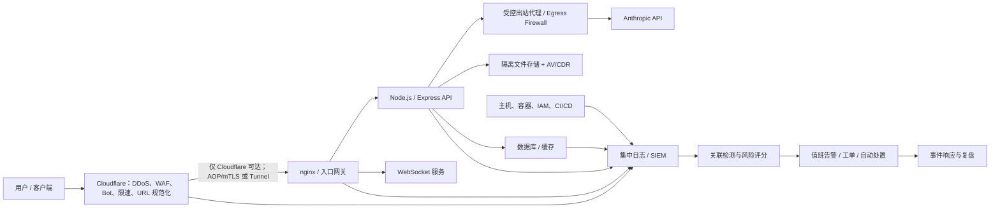
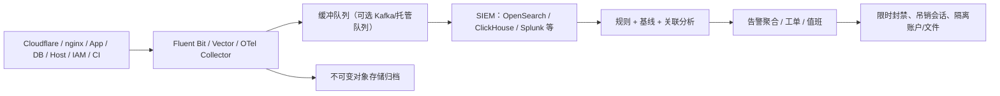

# 牛掌柜 AI 系统加固与安全建议

## 1. 执行摘要

1. **源站不可绕过**：公网请求必须经过 Cloudflare，源站仅接受 Cloudflare 或受控运维网络的连接（源站要配置tls）。
2. **边缘先拦截**：统一 URL 规范化、WAF、速率限制、Bot/Turnstile、协议和请求体约束。
3. **应用不信任边缘**：即使 WAF 被绕过，后端仍执行认证、授权、输入校验、租户隔离和资源限制。
4. **数据最小化**：生产前端包、日志、LLM 请求、测试数据均不得携带不必要的 PII 或凭据。
5. **可检测、可处置、可追溯**：Cloudflare、nginx、应用、数据库、主机和身份日志使用同一追踪标识关联；高风险行为在分钟级告警，并具备受控的自动响应。
6. **安全与稳定共同优化**：对缓存、连接池、WebSocket、LLM 调用、备份恢复和发布链路同步治理。

建议按以下时序实施：

| 时限 | 目标 | 主要事项 |
|---|---|---|
| 0–24 小时 | 消除直接暴露 | 清除前端 PII 并清 CDN 缓存；修复路径遍历；限制上传类型；收紧 CORS；确认源站 IP 是否暴露 |
| 1–7 天 | 封堵主要攻击链 | SSRF 防护；Cloudflare URL 规范化；TLS ≥ 1.2；HSTS；登录限速和 Turnstile；提示词 API 授权；WAF 协议规则 |
| 2–4 周 | 建立纵深防御 | 源站防火墙 + AOP/mTLS；会话改造；文件隔离/杀毒；统一结构化日志；首批告警规则和响应手册 |
| 1–3 个月 | 建立持续运营 | SIEM/SOC、DevSecOps、数据治理、灾备演练、攻击模拟、SLO 和容量治理 |

## 2. 报告复核说明

### 2.1 统计口径

报告摘要写明“17 个漏洞”，但明细编号为 V-01 至 V-20，实际列出 **20 项**（11 项中危、9 项低危）。整改台账应以 V-01～V-20 为准，并由报告出具方确认统计口径。

### 2.2 CORS 风险的实际边界

V-01 必须修复，但当前描述“任意外站可直接窃取已登录用户数据”需要复核：

- `Authorization: Bearer` 不会像 Cookie 一样由浏览器自动附带；攻击站点通常也无法读取另一个源的 `localStorage`。
- 如果后端同时允许凭据跨域、存在 XSS、Token 被泄露，或前端通过不安全的跨窗口通信传递 Token，可利用性会显著上升。
- 因此应将 CORS 改为精确白名单，同时检查 `Access-Control-Allow-Credentials`、预检处理、子域接管和 Token 暴露面，不能把 CORS 当作认证或授权机制。

### 2.3 “可存储危险字符”不等于已发生注入

V-07/V-17 表明危险输入能进入数据层，但只有这些内容进入模板引擎、shell、动态代码执行或不安全渲染时才形成可执行漏洞。正确措施是：

- 禁止业务代码调用 shell 拼接用户输入；使用参数化 API。
- 输出到 HTML、命令、模板、URL 等不同上下文时分别编码。
- 不要仅做通用“特殊字符过滤”，否则容易绕过且会破坏正常业务数据。

## 3. 目标安全架构



关键原则：Cloudflare 是第一道防线，不是唯一防线；任何 Cloudflare 自定义规则都应在源站有等价的请求校验或资源约束。

## 4. 漏洞整改清单

| 编号 | 优先级 | 建议措施 | 验收标准 |
|---|---:|---|---|
| V-04 前端 PII | P0 | 从源码、构建产物、Source Map、对象存储中删除真实数据；重新构建并执行 Cloudflare Cache Purge；排查 Git 历史和其他环境；按数据制度评估通知 | 公开 JS、Source Map、CDN 缓存和历史静态路径均无法检出该 PII |
| V-06 avatar 路径遍历 | P0 | 客户端只提交文件对象 ID，不提交服务器路径；服务端使用固定存储根目录和随机对象键；规范化后确认仍位于根目录内 | `../`、双重编码、绝对路径、符号链接、Windows 路径均被拒绝；单元/集成测试覆盖 |
| V-05 任意文件上传 | P0 | 扩展名、声明 MIME、文件魔数三重白名单；大小/页数/像素/解压比限制；隔离存储；杀毒/沙箱；禁止主动内容同源内联展示 | PHP/JS/EJS/PUG/HTML/SVG 等非业务类型被拒绝；EICAR 测试文件进入隔离；下载强制安全响应头 |
| V-09 SSRF | P0 | 若业务不必抓取 URL，移除 `sourceUrl`；否则限定 HTTPS 和批准域名，解析并拒绝内网/本机/链路本地/保留地址，限制重定向并逐跳重验，经受控代理出站 | IPv4/IPv6、十进制/八进制、DNS 重绑定、重定向、`file:`/`gopher:` 等用例均失败；无云元数据访问 |
| V-01 CORS | P1 | 仅对需要跨域的 API 返回精确 Origin；禁止通配符/正则放大；响应加 `Vary: Origin`；只允许必要方法和头；非白名单预检失败 | 未带 Origin 的服务端调用正常；非白名单浏览器请求无法读取；不存在 Origin 反 |
| V-12/V-16 登录防护 | P1 | 账号、IP、设备、ASN 多维滑动窗口限速；统一失败文案和近似响应时间；风险触发 Turnstile；管理员强制 MFA | 用户名是否存在不能从文案、状态码或显著时延区分；压测证明不会误伤正常用户 |
| V-13/V-14 安全头 | P1 | HSTS 分阶段上线；CSP 从 Report-Only 收敛到 enforce，优先 nonce/hash，禁用 `unsafe-eval`；补齐 nosniff、Referrer-Policy、Permissions-Policy、frame-ancestors | CSP 违规率达到可接受基线后强制执行；关键页面无第三方脚本意外阻断 |
| V-15 Token 存储 | P1 | 短期 Access Token 仅保存在内存；Refresh Token 使用 `__Host-`、Secure、HttpOnly、SameSite Cookie，单次轮换和重放检测；若全 Cookie 会话则增加 CSRF 防护 | XSS 无法直接读取 Refresh Token；旧 Token 重用会吊销令牌族并告警 |
| V-02/V-20 版本与 Server 头 | P2 | `server_tokens off`；Express `x-powered-by` 关闭；边缘统一删除非必要标识头 | 正常和异常响应均不暴露具体软件版本 |
| V-07/V-17 模板/命令字符 | P2 | 数据始终按纯文本处理；禁止动态 EJS 编译和 shell 拼接；按输出上下文编码；增加污点分析规则 | 恶意样本在所有消费链路只作为文本展示，不能执行或影响命令/模板 |

## 5. 分层加固建议

### 5.1 网络、DNS 与 Cloudflare

#### 5.1.1 隐藏并锁定源站

1. 确认所有生产 DNS 记录均代理到 Cloudflare，清理历史 DNS、邮件头、证书透明度、旧子域和错误页中泄露的源站 IP。
2. 云安全组/主机防火墙只允许：
   - Cloudflare 官方 IP 段访问 443；
   - 运维 VPN、堡垒机或 Zero Trust Access 访问管理端口；
   - 必要的监控和备份流量。
3. 启用 **Authenticated Origin Pulls**，优先使用 zone/per-hostname 独享证书；或者使用 Cloudflare Tunnel 让源站无公网入站端口。
4. 边缘到源站启用 Full (strict)，源站证书设置到期监控；AOP 是客户端证书认证，不能用 Origin CA 证书替代。
5. 开启 DNSSEC；注册商账户、Cloudflare 账户和 API Token 强制 MFA，API Token 使用最小权限并定期轮换。

Cloudflare 官方说明：AOP 可让源站只接受来自 Cloudflare 的 HTTPS 请求，zone/per-hostname 证书还能限定到自己的账户边界；全局共享证书只能证明请求来自 Cloudflare 网络。[Authenticated Origin Pulls](https://developers.cloudflare.com/ssl/origin-configuration/authenticated-origin-pull/)

#### 5.1.2 WAF 与协议基线

- 开启 Cloudflare Managed Rules 和 OWASP Core Ruleset，先 Log/Simulate 观察，再按误报情况切换 Block。
- 开启 Normalize incoming URLs，并让规范化后的 URL 同时传给源站，避免边缘与 nginx/Express 对路径解释不一致。[Cloudflare URL normalization](https://developers.cloudflare.com/rules/normalization/)
- 仅开放业务需要的方法：通常为 GET/HEAD/POST/PUT/PATCH/DELETE/OPTIONS；拒绝 TRACE、TRACK 及未使用的 CONNECT。
- 按路由限制 Content-Type，例如 JSON API 只接收 `application/json`，上传只接收 `multipart/form-data`；不支持 gRPC 时显式拒绝。
- WAF 绕过/Skip 规则必须有负责人、原因、到期时间、变更单和命中日志，不允许长期全路径跳过托管规则。
- API 管理后台优先通过 Cloudflare Access/VPN 暴露；机器到机器 API 使用 mTLS 或短期工作负载身份。
- 对 `/ws` 单独配置连接速率、并发连接数和异常消息速率，而不是只依赖 HTTP 请求限速。

#### 5.1.3 分接口限速建议

阈值必须先依据 7～14 天基线调优，下表是起始值而非永久配置：

| 场景 | 建议起始策略 | 动作 |
|---|---|---|
| 登录 | 单 IP 10 次/分钟；单账号 5 次/5 分钟；同 IP 命中 10 个账号/10 分钟 | Managed Challenge，持续异常则临时封禁 |
| 注册/找回密码/验证码 | 单 IP 5 次/10 分钟；单目标 3 次/小时 | Challenge + 冷却；返回统一消息 |
| LLM 生成 | 按用户、租户、IP、Token 成本四维限额 | 429 + 指数退避；超预算通知租户管理员 |
| 文件上传 | 单用户 20 次/分钟，并限制总字节数 | 429；超大/异常文件进入隔离 |
| 导出/批处理 | 单用户并发 1～2 个；租户级队列 | 排队、幂等、可取消；异常量告警 |
| WebSocket | 单用户 3～5 个连接；消息 30～60 条/分钟 | 降速/断开；重复异常暂时封禁 |
| 匿名健康检查 | 单 IP 60 次/分钟 | 超限丢弃或缓存固定响应 |

Turnstile 必须在服务端调用 Siteverify 校验，校验结果应绑定预期 hostname/action；不能只在前端显示组件。

### 5.2 nginx 与入口网关

建议基线（需先在预发布环境测试，参数按实际上传和 WebSocket 需求调整）：

```nginx
server_tokens off;
client_max_body_size 20m;
client_body_timeout 15s;
client_header_timeout 10s;
keepalive_timeout 30s;
send_timeout 30s;
large_client_header_buffers 4 16k;

# 仅在连接来源属于 Cloudflare 官方 IP 段时信任 CF-Connecting-IP；
# Cloudflare IP 段由自动化任务定期同步为 set_real_ip_from。
real_ip_header CF-Connecting-IP;
real_ip_recursive on;

location /api/ {
    proxy_http_version 1.1;
    proxy_set_header Host $host;
    proxy_set_header X-Request-ID $request_id;
    proxy_set_header X-Forwarded-Proto https;
    proxy_connect_timeout 3s;
    proxy_read_timeout 30s;
    proxy_send_timeout 30s;
    proxy_hide_header X-Powered-By;
}
```

其他要求：

- 管理端点与公开端点使用不同 location/上游和访问策略。
- 关闭目录浏览；静态目录不可执行；上传目录与应用目录分离。
- 限制请求头数量和大小，避免大 Header/慢请求消耗连接。
- WebSocket 设置最大消息、空闲超时、心跳和背压；握手校验 Origin、Token、租户和权限。
- 只信任来自受控代理的真实 IP 头；公网直连时攻击者可伪造 `X-Forwarded-For`/`CF-Connecting-IP`。
- 日志记录规范化路径，不记录完整 Authorization、Cookie、Query Token 或上传正文。

### 5.3 主机、容器与运行时

- 应用以非 root 用户运行；容器删除不需要的 Linux capabilities，启用 `no-new-privileges`、只读根文件系统、独立可写临时目录和 seccomp/AppArmor/SELinux。
- 基础镜像最小化并固定 digest；构建与运行镜像分离；生产镜像不包含编译器、shell 工具、源码、测试数据和 `.env`。
- CPU、内存、进程数、文件描述符、临时空间和日志磁盘均设置配额，防止单实例故障扩散。
- SSH 禁止密码和 root 登录；统一堡垒机/SSO/MFA；离职和角色变更自动回收权限。
- 密钥放入 Secrets Manager/Vault/KMS，不写入代码、镜像、前端、日志或 CI 输出；为数据库、对象存储、LLM 分配不同凭据。
- 出站默认拒绝，至少限制到 DNS、时间同步、更新源、Anthropic API、监控和必要第三方；SSRF 功能经过专用 Egress Proxy。
- 主机启用 EDR/FIM：监控应用目录、nginx 配置、systemd、计划任务、SSH key 和高权限账户变化。

### 5.4 应用与 API

#### 5.4.1 身份与会话

- Access Token 5～15 分钟有效；Refresh Token 单次轮换，服务端保存哈希、设备/会话上下文和令牌族状态。
- 检测 Refresh Token 重放：旧 Token 再次使用时，吊销整个令牌族、要求重新登录并产生高优先级告警。
- 登录失败使用统一状态码、文案和近似处理时间；不以“账户不存在”或“密码错误”区分。
- 密码重置链接单次使用、短有效期，不在 URL/日志/Referer 中泄露；重置后按策略吊销已有会话。
- 若迁移到 Cookie 会话，必须同步实施 SameSite、Origin/Fetch Metadata 检查和 CSRF Token；HttpOnly 只降低 Token 被脚本读取的风险，不会自动解决 CSRF。

#### 5.4.2 输入、输出与执行边界

- 使用 JSON Schema/Zod/Joi 等为每个端点做严格 schema 校验：类型、长度、枚举、格式、数组数量、嵌套深度和未知字段。
- 数据库使用参数化查询；OS 功能使用原生库，不调用 `exec("..." + input)`；模板只加载受信任模板，业务文本不参与模板编译。
- React 渲染用户内容保持默认转义；确需富文本时使用经过维护的 sanitizer 和精确标签/属性白名单。
- 错误响应返回稳定错误码和 request ID，不返回堆栈、SQL、路径、依赖名称或密钥；完整细节只进受控日志。
- 所有批处理、生成、导出和写操作使用幂等键、并发上限、超时、取消机制和审计记录。

#### 5.4.3 SSRF

推荐优先级：移除任意 URL → 精确域名白名单 → 受控代理 + 网络隔离。实现时：

- 使用标准 URL 解析器，只允许 `https:`；拒绝用户名密码、非标准端口和混淆主机名。
- DNS 解析后检查全部 A/AAAA 地址，拒绝 loopback、RFC1918、链路本地、组播、保留网段和云元数据地址。
- 不自动跟随重定向；若必须跟随，每一跳重新执行协议、域名、端口、DNS 和 IP 校验。
- 限制响应大小、连接/读取超时，不把内部响应头、错误和正文原样返回客户端。
- 防 DNS 重绑定：连接时绑定已验证的解析结果，并在出口层再次校验。

#### 5.4.4 文件上传与下载

- 允许列表按真实业务定义，例如 `jpg/png/webp/pdf/docx/xlsx`；SVG/HTML 默认不允许。
- 校验扩展名、浏览器声明 MIME 和文件魔数；解码后重新编码图片，文档按需执行 CDR。
- 限制单文件大小、租户配额、图片像素、PDF 页数、压缩层数/解压比，防止 ZIP/XML/Image bomb。
- 上传先进入 quarantine bucket，杀毒/内容检测通过后再移动到 clean bucket；对象存储禁止公开列举。
- 存储键使用随机 UUID，对外只暴露短期签名下载 URL 或受鉴权下载接口；保留原始文件名仅作元数据并安全编码。
- 下载响应使用 `Content-Disposition: attachment`、`X-Content-Type-Options: nosniff`，主动内容使用独立无 Cookie 域名提供。

### 5.5 LLM 业务安全

- **系统提示词不是安全边界**：即使不通过 API 明文返回，也要假定模型可能被诱导复述；权限、密钥和授权决策不得依赖提示词保密。
- 当前模型无工具权限是良好隔离；未来增加搜索、数据库、发信或执行工具时，每个工具必须独立授权、限制参数、租户和调用预算，高风险动作需人工确认。
- 用户输入、外部网页、文件内容和历史对话都标记为不可信数据，不能覆盖系统策略；对指令与数据使用结构化分隔。
- 输出在进入 HTML、查询、模板或外部 API 前重新校验；禁止将模型输出直接作为 shell、SQL 或代码执行。

### 5.6 数据库、缓存与数据治理

- 建立数据分级：公开、内部、敏感、受限；姓名、电话、邮箱、Telegram 标识至少按敏感数据管理。
- 数据库不直接暴露公网；按服务建立独立账号，读写分权，禁止应用使用超级管理员。
- 为租户查询、会话、时间范围和高频筛选建立索引；启用慢查询日志和查询超时，避免安全控制引入不可控性能退化。
- 定义数据保留和删除策略；备份也需遵循到期删除，删除任务有审计和失败告警。

## 6. 日志、安全检测与告警设计

### 6.1 总体架构

推荐将可观测性数据分为三类：

- **安全审计日志**：登录、授权失败、权限变更、敏感读取/导出、上传、密钥和配置变化。要求完整、不可随意关闭。
- **访问/基础设施日志**：Cloudflare、nginx、WebSocket、主机、容器、数据库审计、VPC/安全组流日志。
- **运行观测数据**：指标、Trace、错误和性能事件，用于发现 DoS、故障与攻击的组合信号。



部署选择：

- **Cloudflare Enterprise**：用 Logpush 输出 `http_requests`、`firewall_events`、WebSocket、Turnstile 等数据到 SIEM/对象存储。Logpush 接近实时，但不提供存储，任务失败期间不能历史回填，因此必须为 Logpush 健康状态单独告警。[Cloudflare Logpush](https://developers.cloudflare.com/logs/logpush/)
- **非 Enterprise/成本优先**：保留 Cloudflare 控制台安全事件用于边缘分析；由 nginx 记录必要的边缘标识（如 `CF-Ray`、受信客户端 IP），应用输出结构化审计日志，使用 Vector/Fluent Bit 发送到 OpenSearch/ClickHouse/Loki，并归档到启用 Object Lock/WORM 的对象存储。需注意此方案无法完全替代 Cloudflare 全量边缘日志。

### 6.2 统一事件字段

所有结构化日志使用 JSON、UTC 和统一命名，最少包含：

```json
{
  "@timestamp": "2026-07-30T10:20:30.123Z",
  "event_name": "auth.login.failed",
  "event_category": "authentication",
  "severity": "medium",
  "security_event": true,
  "environment": "production",
  "service": "api",
  "service_version": "git-sha-or-release",
  "trace_id": "...",
  "request_id": "...",
  "cf_ray_id": "...",
  "source_ip": "trusted-derived-ip",
  "source_asn": 0,
  "actor_id": "internal-user-id-or-null",
  "tenant_id": "internal-tenant-id-or-null",
  "session_id_hash": "hmac-hash-or-null",
  "action": "login",
  "resource_type": "account",
  "resource_id": "opaque-id-or-null",
  "result": "failure",
  "reason_code": "INVALID_CREDENTIALS",
  "http_method": "POST",
  "route_template": "/api/auth/login",
  "http_status": 401,
  "latency_ms": 86,
  "risk_score": 45
}
```

要求：

- 使用 `route_template`，避免把对象 ID、Token 或 PII 写入 path/query。
- Session/Token 仅记录不可逆或带服务端密钥的 HMAC 指纹，绝不记录原文。
- 密码、Authorization、Cookie、Refresh Token、API Key、数据库连接串、验证码、完整 LLM 提示/响应、文件正文禁止入日志。
- 姓名、电话、邮箱和消息正文默认脱敏；只有明确的调查授权才能访问受限原始数据。
- 对换行和控制字符编码，防日志注入；限制单条事件大小和字段长度。
- nginx、应用、数据库、容器统一 NTP，监控时钟漂移。

### 6.3 必须记录的业务安全事件

| 类别 | 事件 |
|---|---|
| 认证 | 登录成功/失败、MFA、登出、密码重置、Token 签发/刷新/吊销/重放、会话强制下线 |
| 授权 | 401/403、跨租户拒绝、管理员操作、角色/团队/权限变更、紧急账户使用 |
| 数据 | 敏感记录查看、搜索、批量导出、删除、脱敏失败、备份/恢复、保留任务失败 |
| 文件 | 上传开始/完成、MIME/魔数校验、杀毒/CDR、隔离/放行、下载、配额拒绝 |
| 输入防护 | Schema 失败、路径遍历、SSRF、模板/命令特征、异常 Content-Type、非法方法/路径 |
| LLM | 模型/版本、Token 数、耗时、策略分类、提示注入/PII 检测、工具调用及审批、预算超限 |
| 配置与运维 | 发布、回滚、配置/密钥/WAF/IAM/安全组变化、审计关闭、日志管道失败 |
| 系统 | 进程崩溃、OOM、磁盘/文件描述符耗尽、5xx、依赖超时、数据库慢查询、证书到期 |

### 6.4 首批检测与告警规则

| 规则 | 起始条件 | 级别 | 建议响应 |
|---|---|---:|---|
| 凭据填充 | 同 IP/设备 10 分钟尝试 ≥10 个账号，失败 ≥20 次 | P1 | 立即 Challenge/限时封禁；关联 ASN/代理；通知值班 |
| 账号暴力破解 | 同账号 10 分钟来自 ≥5 个 IP 且失败 ≥10 次 | P1 | 临时冻结登录或强制 MFA；提醒用户；避免永久锁定造成 DoS |
| Refresh Token 重放 | 已轮换/吊销 Token 指纹再次使用 | P0 | 吊销令牌族、强制重新登录、立即电话/值班告警 |
| 管理权限变化 | 新增管理员、关闭 MFA、使用紧急账户 | P0/P1 | 实时通知；非变更窗口自动暂停高风险会话 |
| 跨租户/IDOR 探测 | 单主体 5 分钟出现 ≥10 个不同资源的 403/404 | P1 | 限速；保留证据；复核是否数据已泄露 |
| SSRF 探测 | 命中私网/本机/元数据 IP、禁用协议、重定向重验失败 | P1 | 阻断请求；临时禁用主体相关生成任务；排查出站流量 |
| 路径/协议绕过 | `%0d/%0a`、双编码 traversal、`application/grpc` 命中未支持路由 | P1 | 边缘阻断；按 IP/主体聚合；检查是否有源站直达 |
| 恶意上传 | AV 命中、MIME/魔数不符、解压炸弹、主动内容 | P1 | 隔离文件；禁止下载；限制账号；通知安全人员 |
| 异常批量读取/导出 | 5 分钟读取量 > 个人 30 日 P99 或单次导出超过政策阈值 | P1 | 暂停导出、step-up、通知数据负责人 |
| WAF 攻击突增 | 5 分钟拦截量 > 同时段基线 5 倍且来源/规则集中 | P1/P2 | 自动聚类来源；临时规则；确认是否业务误报 |
| 源站绕过 | 源站收到非 Cloudflare/AOP 连接或无有效 `CF-Ray` 的公网请求 | P0 | 防火墙立即拒绝；调查源站 IP 泄露和规则漂移 |
| LLM 注入/数据提取 | 同主体多次命中提示注入、系统提示/PII/密钥提取策略 | P1/P2 | 降级/拒绝模型调用；限制账号；人工复核脱敏样本 |
| WebSocket 滥用 | 连接/消息速率、异常帧、鉴权失败显著超基线 | P1/P2 | 断开并限时封禁；检查消息队列和资源消耗 |
| 可用性攻击 | 5xx、P95 延迟、连接数、CPU/内存/队列同时异常 | P1 | 扩容/降级/熔断；按来源与接口启用更严限速 |
| 日志失联 | 任一关键源 5 分钟无心跳；Logpush/Collector 持续失败 | P0/P1 | 立即通知平台与安全；切换缓冲/备用目的地 |
| 审计篡改 | 审计配置关闭、时间回拨、归档删除/WORM 失败 | P0 | 隔离高风险权限；保全证据；启动事件响应 |

### 6.5 告警分级与时效

| 级别 | 示例 | 通知/响应目标 |
|---|---|---|
| P0 紧急 | Token 重放伴随管理员访问、源站绕过、审计篡改、确认数据泄露 | 1 分钟内推送到值班电话/IM，5 分钟确认，15 分钟启动处置 |
| P1 高 | 凭据填充、SSRF、恶意上传、跨租户探测、异常导出 | 5 分钟内推送，15 分钟确认，30 分钟开始遏制 |
| P2 中 | 单点扫描、WAF 规则趋势、异常登录但未成功 | 进入安全队列，4 小时内研判 |
| P3 低 | 基线偏差、配置卫生、低置信情报 | 工作日内工单处理和趋势分析 |

### 6.6 自动响应

可以自动执行：

- Cloudflare 对高置信恶意 IP/ASN 设置 **有时限** 的 Challenge/Block。
- 吊销确认重放的 Token 族、断开关联 WebSocket。
- 隔离恶意文件、暂停异常导出任务、收紧单主体限额。

不建议仅凭单一低置信信号自动执行：永久封禁大网段、永久删除账户/数据、关闭整个生产系统、向外部主体发送攻击归因结论。所有自动动作应有 TTL、审批边界、审计记录和一键回滚。
